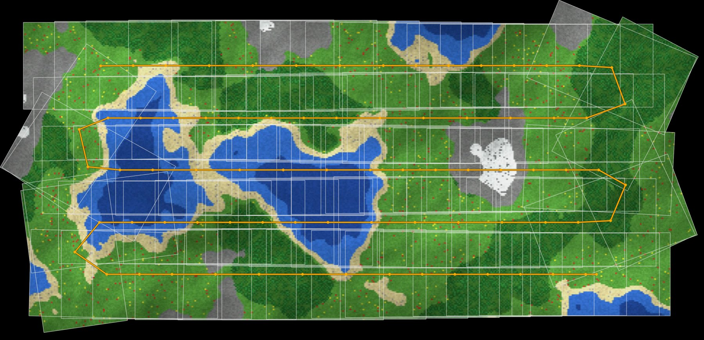
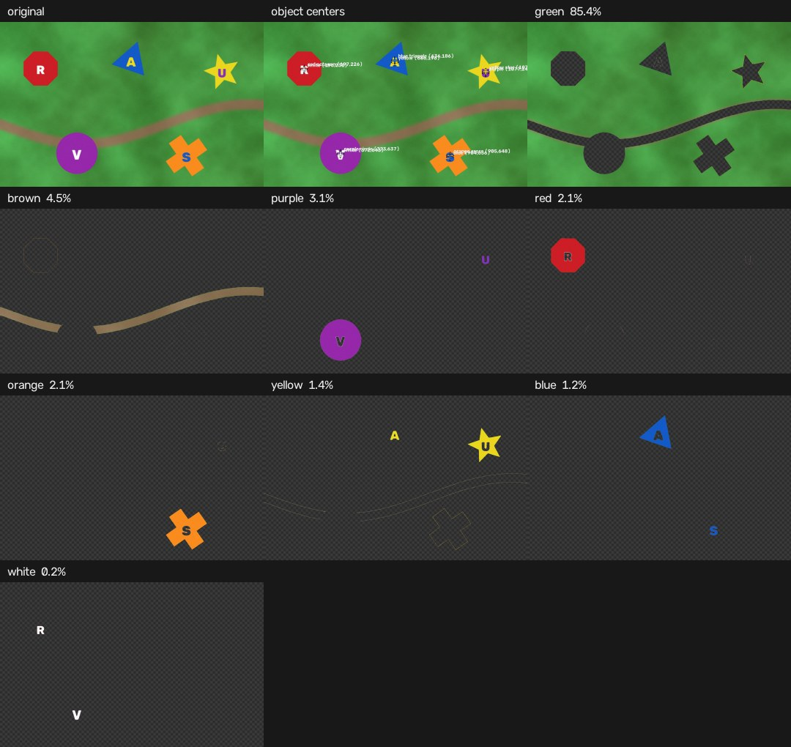
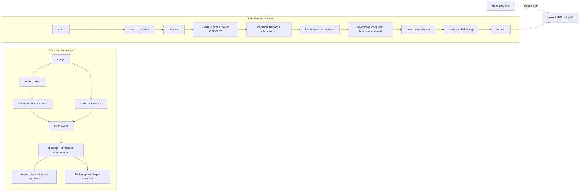

# UAV Ground School

**Solutions to the UAVs@Berkeley Software Ground School 2026, written to competition grade: OpenCV color segmentation, SUAS target shape detection, and drone video mosaicking with loop closure and bundle adjustment, in Python and C++.**

[](https://github.com/KarthikSubramanian07/UAV-Ground-School/actions/workflows/ci.yml)


`computer-vision` `opencv` `uav` `drones` `image-stitching` `orthomosaic` `bundle-adjustment` `suas` `color-segmentation` `cpp`

Live showcase, with an in browser version of the color splitter: **[karthiksubramanian07.github.io/UAV-Ground-School](https://karthiksubramanian07.github.io/UAV-Ground-School/)**

<p align="center">
  
</p>

The ground school hands out a "skill booster" each week: something small that sort of works counts as a win. This repo takes each booster as far as it can reasonably go, then measures the result against ground truth instead of eyeballing it.

## Weeks

| Week | Topic | Challenges | Where |
| --- | --- | --- | --- |
| 2 | Computer vision and aerial imagery | Color Me Impressed, I'll be Needin' Stitches, both again in C++ | [`week02/`](week02/README.md), [lecture notes](docs/week02/NOTES.md) |

## Week 2 at a glance

**Color Me Impressed.** Give it an image path; it splits the image into one image per color, shows them, and prints the center of every colored object. Beyond the brief it classifies each object's shape the way a SUAS target detector would (red octagon, blue triangle, yellow star) and can learn an image's palette with k-means in CIELAB.

<p align="center">
  
</p>

**I'll be Needin' Stitches.** Give it a nadir drone video; it samples frames, tracks them with ORB or SIFT, closes loops between overlapping lawnmower passes, jointly optimizes every frame pose, fixes exposure differences, and blends a seamless mosaic.

The club's flight video is private, so the repo ships a flight simulator: a seeded Minecraft style world, a survey flight over it rendered to MP4 (lens distortion, motion blur, exposure drift, altitude wobble, sensor noise) and the true camera pose of every frame. On the harder flight:

| Pipeline | Pose RMSE | Max error | ZNCC vs true world |
| --- | ---: | ---: | ---: |
| Sequential chaining (what most solutions do) | 56.72 px | 159.65 px | 0.486 |
| + loop closure and bundle adjustment | 7.21 px | 17.56 px | 0.839 |
| + lens undistortion, gain compensation, multi band blending | **0.37 px** | **0.91 px** | **0.941** |
| OpenCV's built in `cv2.Stitcher` (calm flight, 67 frames) | broken mosaic after 104 s | | |

Full numbers in [`docs/week02/benchmark.md`](docs/week02/benchmark.md), regenerated by `python -m week02 benchmark docs/week02`.

## Quick start

```bash
git clone https://github.com/KarthikSubramanian07/UAV-Ground-School
cd UAV-Ground-School
python -m venv .venv && source .venv/bin/activate
pip install -e ".[dev]"

# Test data: stop sign, apple, SUAS targets, and a survey flight with ground truth
python -m week02 simulate out/sim

# Option 1
python -m week02 colors out/sim/targets.jpg --out out/layers

# Option 2
python -m week02 stitch out/sim/flight.mp4 --out out/mosaic.jpg \
  --path-overlay out/path.jpg --truth out/sim/flight_truth.csv --world out/sim/world.png
```

Using a real flight video works the same way: `python -m week02 stitch your_flight.mp4 --out mosaic.jpg`. Add `--live` to watch the mosaic grow and `--scale 0.5` for large 4K footage.

## Architecture



| Module | Responsibility |
| --- | --- |
| [`week02/colors.py`](week02/colors.py) | HSV band partition, k-means palette discovery, object centers, layer rendering |
| [`week02/shapes.py`](week02/shapes.py) | Rotation and scale invariant shape classification by IoU template search |
| [`week02/features.py`](week02/features.py) | Feature extraction, symmetric matching, RANSAC similarity estimation |
| [`week02/stitching.py`](week02/stitching.py) | Frame sampling, tracking, loop closures, the end to end pipeline |
| [`week02/mosaic.py`](week02/mosaic.py) | Bundle adjustment, gain compensation, feather and multi band blending |
| [`week02/synth.py`](week02/synth.py) | Test images, voxel world, survey flight renderer with ground truth |
| [`week02/evaluate.py`](week02/evaluate.py) | Umeyama alignment, pose error, photometric agreement |
| [`week02/cpp/`](week02/cpp) | C++17 ports of both challenges |
| [`site/`](site) | The showcase site, built by [`scripts/build_site.py`](scripts/build_site.py) |

## Quality

* `pytest` runs unit tests for every module plus end to end accuracy checks: shapes across 13 classes, 3 sizes and 3 rotations; exact color partitioning of the whole HSV cube; bundle adjustment removing injected drift and shrugging off outliers; a full stitch held to sub pixel pose error against the simulator.
* The C++ binaries are checked for parity with Python in CI (same colors, same centers within 1.5 px, same shapes, stitching accuracy against ground truth).
* GitHub Actions: ruff, tests on Python 3.10 and 3.12, the C++ build against Ubuntu's OpenCV 4.6, the site build, and deployment to GitHub Pages on every push to `main`.

## License

MIT. See [LICENSE](LICENSE).
