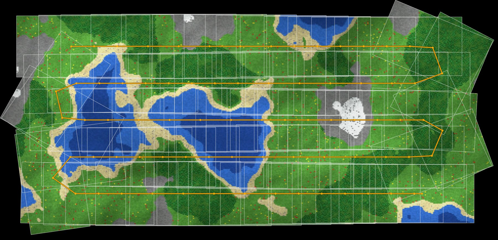
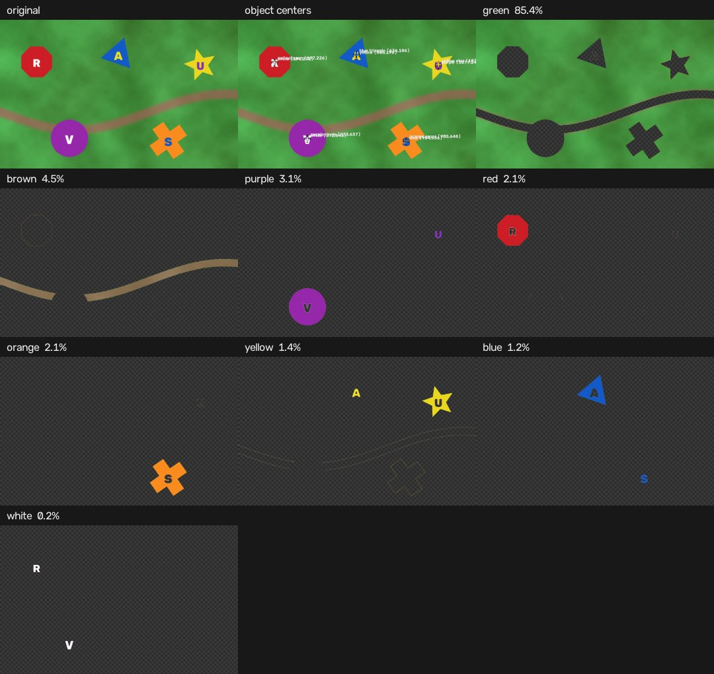
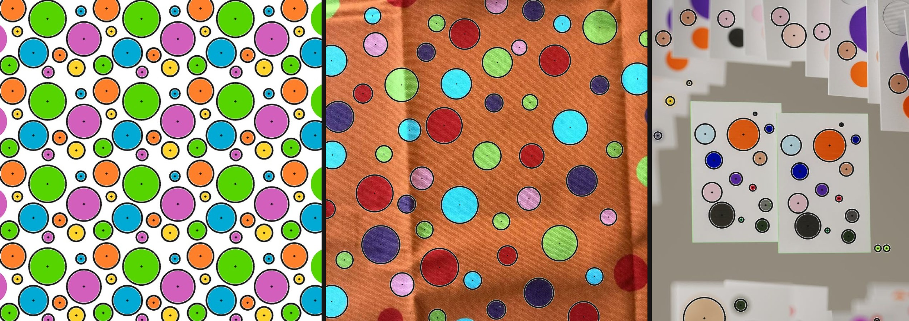
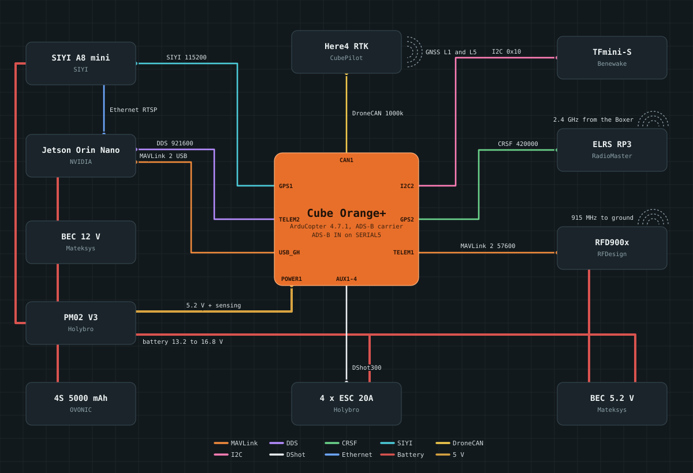
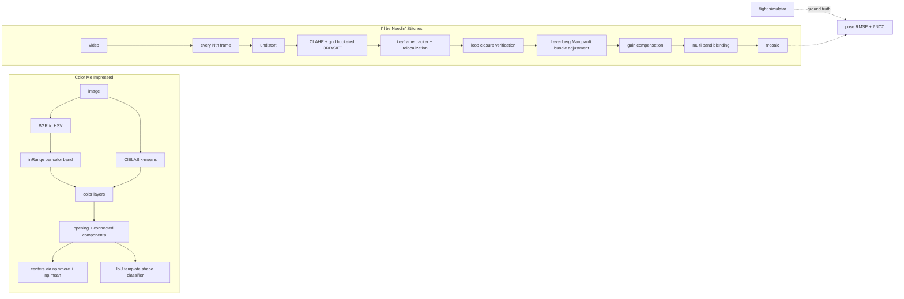
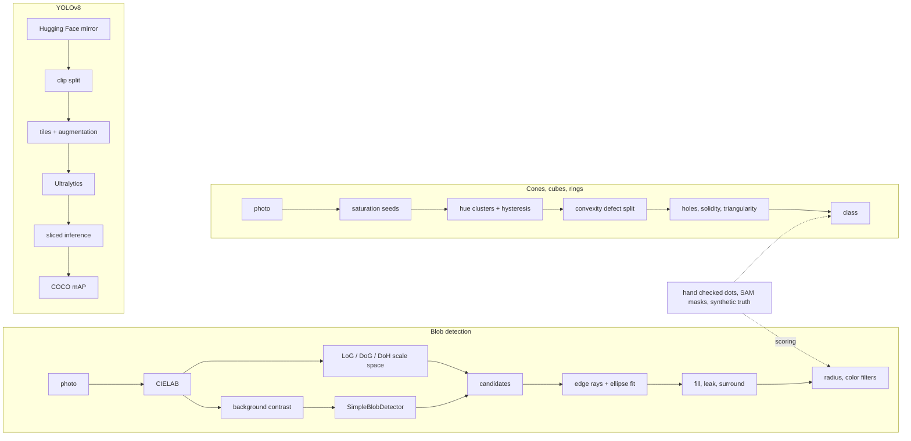

# UAV Ground School

**Solutions to the UAVs@Berkeley Software Ground School 2026, written to competition grade: color segmentation, SUAS target shapes and drone video mosaicking (week 2), blob detection, classical game piece detection and YOLOv8 (week 3), and a flight controller design verified on real ArduPilot firmware with every protocol on it implemented from scratch (week 4), in Python and C++, measured against ground truth.**

[](https://github.com/KarthikSubramanian07/UAV-Ground-School/actions/workflows/ci.yml)


`computer-vision` `opencv` `uav` `drones` `image-stitching` `orthomosaic` `bundle-adjustment` `suas` `color-segmentation` `blob-detection` `object-detection` `yolov8` `ardupilot` `mavlink` `dronecan` `can-bus` `flight-controller` `cpp`

Live showcase: **[uav-ground-school.pages.dev](https://uav-ground-school.pages.dev/)** (week 2, with an in browser color splitter) **[/week3](https://uav-ground-school.pages.dev/week3)** (with a detector explorer) and **[/week4](https://uav-ground-school.pages.dev/week4)** (a clickable wiring diagram, a logic analyser and a PID playground).

<p align="center">
  
</p>

The ground school hands out a "skill booster" each week: something small that sort of works counts as a win. This repo takes each booster as far as it can reasonably go, then measures the result against ground truth instead of eyeballing it.

## Weeks

| Week | Topic | Challenges | Where |
| --- | --- | --- | --- |
| 2 | Computer vision and aerial imagery | Color Me Impressed, I'll be Needin' Stitches, both again in C++ | [`week02/`](week02/README.md), [lecture notes](docs/week02/NOTES.md) |
| 3 | Object detection | Blob detection (SimpleBlobDetector, LoG, DoG, DoH, contours), cones, cubes and rings, YOLOv8, the classical parts again in C++ | [`week03/`](week03/README.md), [lecture notes](docs/week03/NOTES.md) |
| 4 | Flight controllers | Protocol Pro: a drone designed around the Cube Orange+, wired pin by pin, a design rule checker, the ArduPilot parameters, MAVLink, DroneCAN, CAN, RTCM, CRSF, SBUS and DShot from scratch, ArduCopter 4.7.1 in the loop, the codecs again in C++ | [`week04/`](week04/README.md), [lecture notes](docs/week04/NOTES.md) |

## Week 2 at a glance

**Color Me Impressed.** Give it an image path; it splits the image into one image per color, shows them, and prints the center of every colored object. Beyond the brief it classifies each object's shape the way a SUAS target detector would (red octagon, blue triangle, yellow star) and can learn an image's palette with k-means in CIELAB.

<p align="center">
  
</p>

**I'll be Needin' Stitches.** Give it a nadir drone video; it samples frames, tracks them with ORB or SIFT, closes loops between overlapping lawnmower passes, jointly optimizes every frame pose, fixes exposure differences, and blends a seamless mosaic.

The club's flight video is private, so the repo ships a flight simulator: a seeded Minecraft style world, a survey flight over it rendered to MP4 (lens distortion, motion blur, exposure drift, altitude wobble, sensor noise) and the true camera pose of every frame. On the harder flight:

| Pipeline | Pose RMSE | Max error | ZNCC vs true world |
| --- | ---: | ---: | ---: |
| Sequential chaining (what most solutions do) | 56.72 px | 159.65 px | 0.486 |
| + loop closure and bundle adjustment | 7.21 px | 17.56 px | 0.839 |
| + lens undistortion, gain compensation, multi band blending | **0.37 px** | **0.91 px** | **0.941** |
| OpenCV's built in `cv2.Stitcher` (calm flight, 67 frames) | broken mosaic after 104 s | | |

Full numbers in [`docs/week02/benchmark.md`](docs/week02/benchmark.md), regenerated by `python -m week02 benchmark docs/week02`.

## Week 3 at a glance

<p align="center">
  
</p>

**Blob detection.** Every dot in the three photos was annotated and checked by hand, so seven detectors are scored instead of eyeballed. SimpleBlobDetector on grayscale finds none of the 53 dots on the orange fabric (they have the cloth's gray value); on a color contrast map it finds 50. LoG, DoG and DoH written from scratch in CIELAB, with an ellipse fit to each dot's color edge, reach 0.991 to 0.998 F1 on the photos, and 0.998 F1 with 0.02 px median center error on 21 synthetic scenes with exact truth.

**Cones, cubes and rings** with no training data: saturation seeds, hysteresis, a convexity defect cut between the touching cubes, and a classifier that uses only geometry (holes, convexity, triangularity). 6 of 6 pieces, mean mask IoU 0.942 against SAM 2 masks, unchanged under rotation, mirroring, scaling and hue shifts.

**YOLOv8** on the notebook's football dataset, without a Roboflow key. Every test clip in Roboflow's split also appears in training, so models are compared on held out clips. Training on tiles and running sliced inference lifts mAP50 from 0.588 to 0.820 and ball AP50 from 0.00 to 0.57; offline augmentation and 1280 px inference did not help. Results: [`docs/week03/yolo/results.md`](docs/week03/yolo/results.md).

## Week 4 at a glance

<p align="center">
  
</p>

**A drone designed from parts you can buy**, every figure sourced and every unpublished one marked as an estimate: Cube Orange+, Here4 RTK on DroneCAN, Jetson Orin Nano on DDS and MAVLink, SIYI gimbal, ExpressLRS, RFD900x and a TFmini-S on a Holybro X500 V2. The wiring diagram and a pin by pin harness are generated from the design, and a 30 rule checker (logic levels, baud rates, receive DMA, I2C addresses, CAN load, 5 V budgets, bandwidth, firmware features, ESC and connector ratings) reports 0 errors and 17 actionable warnings. Each rule is tested by breaking the design on purpose.

**Every protocol from its specification**: MAVLink from the XML (every `ardupilotmega` message byte identical to pymavlink, signing included), DroneCAN from the DSDL (signatures and transfers identical to pydronecan), CAN bit by bit with stuffing and arbitration, RTCM 3, CRSF, SBUS, DShot with GCR telemetry, UART and I2C. One RTK correction is followed through five of them, from base station to the drone's GPS.

**Checked on the real firmware**: ArduCopter 4.7.1 built from its release tag and driven only by this repo's MAVLink code accepts 72 of the 75 generated parameters (the other three cannot exist in simulation), sends exactly the predicted telemetry, verifies MAVLink signing, and flies this airframe's mass and inertia. The pitch step rises in 0.32 s; the week's own PID simulator with ArduPilot's gains predicts 0.33 s.

## Quick start

```bash
git clone https://github.com/KarthikSubramanian07/UAV-Ground-School
cd UAV-Ground-School
python -m venv .venv && source .venv/bin/activate
pip install -e ".[dev]"

# Test data: stop sign, apple, SUAS targets, and a survey flight with ground truth
python -m week02 simulate out/sim

# Option 1
python -m week02 colors out/sim/targets.jpg --out out/layers

# Option 2
python -m week02 stitch out/sim/flight.mp4 --out out/mosaic.jpg \
  --path-overlay out/path.jpg --truth out/sim/flight_truth.csv --world out/sim/world.png

# Week 3
python -m week03 compare docs/week03/photos/polka_dots_2.jpg --out out/detectors.jpg
python -m week03 objects docs/week03/photos/objects.jpg --out out/pieces.jpg
pip install -e ".[yolo]" && python -m week03 yolo fetch && python -m week03 yolo train baseline tiles

# Week 4
python -m week04 check
python -m week04 params --out protocol_pro.param
python -m week04 journey
```

Using a real flight video works the same way: `python -m week02 stitch your_flight.mp4 --out mosaic.jpg`. Add `--live` to watch the mosaic grow and `--scale 0.5` for large 4K footage.

## Architecture


```mermaid
flowchart LR
    subgraph option1 [Color Me Impressed]
        img[image] --> hsv[BGR to HSV] --> bands[inRange per color band] --> layers[color layers]
        img --> lab[CIELAB k-means] --> layers
        layers --> cc[opening + connected components] --> centers[centers via np.where + np.mean]
        cc --> shapes[IoU template shape classifier]
    end
    subgraph option2 [I'll be Needin' Stitches]
        video[video] --> sample[every Nth frame] --> undistort[undistort] --> feat[CLAHE + grid bucketed ORB/SIFT]
        feat --> track[keyframe tracker + relocalization] --> loops[loop closure verification]
        loops --> ba[Levenberg Marquardt bundle adjustment] --> gains[gain compensation] --> blend[multi band blending] --> mosaic[mosaic]
    end
    sim[flight simulator] -. ground truth .-> eval[pose RMSE + ZNCC]
    mosaic -.-> eval
```

Week 3:


```mermaid
flowchart LR
    subgraph dots [Blob detection]
        photo[photo] --> lab[CIELAB]
        lab --> ss[LoG / DoG / DoH scale space] --> cand[candidates]
        lab --> contrast[background contrast] --> sbd[SimpleBlobDetector] --> cand
        cand --> fit[edge rays + ellipse fit] --> verify[fill, leak, surround] --> filt[radius, color filters]
    end
    subgraph pieces [Cones, cubes, rings]
        img[photo] --> seeds[saturation seeds] --> grow[hue clusters + hysteresis] --> split[convexity defect split] --> geo[holes, solidity, triangularity] --> cls[class]
    end
    subgraph yolo [YOLOv8]
        hf[Hugging Face mirror] --> clip[clip split] --> tiles[tiles + augmentation] --> train[Ultralytics] --> sliced[sliced inference] --> map[COCO mAP]
    end
    truth[hand checked dots, SAM masks, synthetic truth] -. scoring .-> filt
    truth -.-> cls
```

| Module | Responsibility |
| --- | --- |
| [`week02/colors.py`](week02/colors.py) | HSV band partition, k-means palette discovery, object centers, layer rendering |
| [`week02/shapes.py`](week02/shapes.py) | Rotation and scale invariant shape classification by IoU template search |
| [`week02/features.py`](week02/features.py) | Feature extraction, symmetric matching, RANSAC similarity estimation |
| [`week02/stitching.py`](week02/stitching.py) | Frame sampling, tracking, loop closures, the end to end pipeline |
| [`week02/mosaic.py`](week02/mosaic.py) | Bundle adjustment, gain compensation, feather and multi band blending |
| [`week02/synth.py`](week02/synth.py) | Test images, voxel world, survey flight renderer with ground truth |
| [`week02/evaluate.py`](week02/evaluate.py) | Umeyama alignment, pose error, photometric agreement |
| [`week02/cpp/`](week02/cpp) | C++17 ports of both challenges |
| [`week03/blobs.py`](week03/blobs.py) | SimpleBlobDetector wrapper, scale space LoG, DoG and DoH with pyramids, sub pixel peaks and sidelobe suppression, contour filtering |
| [`week03/dots.py`](week03/dots.py) | The polka dot pipeline: candidates, edge fit, verification, color names and filters |
| [`week03/objects.py`](week03/objects.py) | Cones, cubes and rings: seeds, hysteresis, the touching piece split, geometric classification |
| [`week03/synth.py`](week03/synth.py), [`evaluate.py`](week03/evaluate.py), [`benchmark.py`](week03/benchmark.py) | Synthetic scenes with exact truth, scoring rules, the detector benchmark |
| [`week03/football.py`](week03/football.py), [`augment.py`](week03/augment.py), [`slicing.py`](week03/slicing.py), [`detmetrics.py`](week03/detmetrics.py), [`detector.py`](week03/detector.py) | Option 2: dataset and clip split, Roboflow style tiling and augmentation, sliced inference, COCO style mAP, the experiments |
| [`week03/cpp/`](week03/cpp) | C++17 ports of the dot detectors and the game piece classifier |
| [`week04/design.py`](week04/design.py), [`check.py`](week04/check.py), [`params.py`](week04/params.py), [`diagram.py`](week04/diagram.py) | The design as data, the pin by pin harness, the design rule checker, the ArduPilot parameters, the wiring diagram |
| [`week04/mavlink.py`](week04/mavlink.py), [`dronecan.py`](week04/dronecan.py), [`can.py`](week04/can.py), [`rtcm.py`](week04/rtcm.py), [`rc.py`](week04/rc.py), [`dshot.py`](week04/dshot.py), [`uart.py`](week04/uart.py), [`i2c.py`](week04/i2c.py), [`crc.py`](week04/crc.py) | The protocols, from their specifications |
| [`week04/performance.py`](week04/performance.py), [`links.py`](week04/links.py), [`pid.py`](week04/pid.py), [`journey.py`](week04/journey.py), [`sitl.py`](week04/sitl.py) | Flight time, link budgets, the PID simulator, the RTK journey, ArduCopter SITL experiments |
| [`week04/cpp/`](week04/cpp) | C++17 port of the protocol codecs |
| [`site/`](site) | The showcase site, built by [`scripts/build_site.py`](scripts/build_site.py) |

## Quality

* `pytest` runs unit tests for every module plus end to end accuracy checks: shapes across 13 classes, 3 sizes and 3 rotations; exact color partitioning of the whole HSV cube; bundle adjustment removing injected drift and shrugging off outliers; a full stitch held to sub pixel pose error against the simulator.
* Week 3 tests cover scale space theory (peak scale and height), polarity, color only blobs, sidelobes, a comparison with scikit-image's `blob_log`, the edge fit on exact synthetic truth, evaluation semantics, object features and invariance, augmentations that move boxes with pixels, tiling, the mAP implementation against Ultralytics, and regression tests on the ground school photos.
* Week 4 tests compare the protocols with pymavlink, pydronecan and pyrtcm, break the design one rule at a time, validate the parameters against ArduCopter 4.7.1's metadata, check the recorded SITL measurements against the predictions, and hold the page's JavaScript PID simulator to bit for bit agreement with Python.
* The C++ binaries are checked for parity with Python in CI (week 2: same colors, centers within 1.5 px, same shapes, stitching accuracy; week 3: the same dots with F1 1.000 and centers within 0.01 px, the same game pieces; week 4: 2,908 protocol cases byte for byte).
* GitHub Actions: ruff (lint everywhere, formatting enforced for week 4), tests on Python 3.10 and 3.12, the C++ build against Ubuntu's OpenCV 4.6, and the site build. Once every check is green on `main`, CI triggers a Cloudflare Pages deploy hook and the site at uav-ground-school.pages.dev rebuilds from that commit.

## License

MIT. See [LICENSE](LICENSE).
