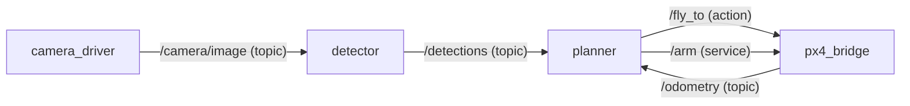

# Week 5 notes: ROS 2, nodes and communication

Notes from UAVs@Berkeley Software Ground School, 6 October 2026. Agenda: why ROS, nodes, the three ways nodes talk (topics, services, actions), callbacks, QoS, choosing between them, and the whole drone wired up. The assignment: take notes on nodes, topics, services, actions, QoS and function callbacks.

## 1. Why ROS

One drone runs many programs. The slides' example is an autonomous package delivery to a ground target:

* The **camera driver** continuously supplies image frames.
* The **object detector** runs detection on those frames and hands the results to the planner.
* The **planner** works out how to reach the target and sends vehicle commands to the flight controller.
* The **PX4 bridge** carries those commands to the flight controller, and carries the flight controller's state (for example, how far the drone is from the waypoint) back to the planner.

These programs run at different rates, may be written in different languages, and start, crash and restart independently. They need a common way to talk. That is ROS 2:

| ROS 2 is | ROS 2 is not |
| --- | --- |
| Libraries and tools that run on top of an OS, usually Ubuntu | An operating system, despite the name |
| A common language: each program becomes a node, and nodes exchange typed messages in Python or C++ | A replacement for the flight controller's firmware |
| A big ecosystem: camera drivers, a PX4 bridge, tools to inspect, record and replay data | Something you have to write from scratch for every robot |

The lecturer's framing: ROS provides a framework that lets the high level autonomy software "operate" the robot.

## 2. Nodes

A node does **one job**: a camera driver, a detector, a planner. Small nodes are easier to test, restart and replace. Nodes **talk only through interfaces**: typed messages over topics, services and actions, never by calling each other's functions.

### Discovery

How does the detector find the camera?

* **ROS 1: a master.** Every node registers with a master node. The detector asks the master who publishes images, the master replies with the camera node's address, and the two connect directly. The master is a single point of failure.
* **ROS 2: no master.** Discovery is handled by DDS (Data Distribution Service; the default implementation is eProsima Fast DDS). Each node announces itself on the network and listens for the others.

DDS discovery runs in two phases:

1. **SPDP** (Simple Participant Discovery Protocol): each participant multicasts announcements to `239.255.0.1`, port `7400 + 250 x domain`. Participants that hear each other learn each other's addresses.
2. **SEDP** (Simple Endpoint Discovery Protocol): matched participants exchange their endpoints, meaning every publisher and subscriber with its topic name, type and QoS. A writer and a reader with the same topic, type and compatible QoS are matched.

`ROS_DOMAIN_ID` (default 0) picks the domain, and so the port. Nodes in different domains never see each other, which is how several teams share one network without crosstalk.

## 3. Topics

The three patterns, from the slides:

| Topic | Service | Action |
| --- | --- | --- |
| A stream: publishers broadcast, subscribers listen, nobody waits for a reply | A question: a client asks, one server answers, once; should be quick | A task: a client sets a goal, the server reports progress, then a result; can be canceled |
| Like a radio station | Like asking someone a question | Like a delivery order with live tracking |

All three are typed: `.msg`, `.srv` and `.action` files define the structure.

A topic is:

* **Named and typed.** `/camera/image` always carries `sensor_msgs/Image`, defined in a `.msg` file.
* **Asynchronous.** `publish()` returns immediately; the publisher never waits for anyone.
* **Many to many and anonymous.** Publishers do not know who is subscribed, or whether anyone is.
* **Buffered.** Each side keeps a small queue (its QoS depth), so a slow subscriber loses old messages instead of slowing the publisher down.

| Topic | Message type | Published by | Rate |
| --- | --- | --- | --- |
| `/camera/image` | `sensor_msgs/Image` | camera_driver | about 30 Hz |
| `/detections` | `vision_msgs/Detection2DArray` | detector | per frame |
| `/odometry` | `nav_msgs/Odometry` | state_estimator | 50+ Hz |
| `/battery` | `sensor_msgs/BatteryState` | px4_bridge | about 1 Hz |

**Rule of thumb:** use a topic when data flows continuously, several nodes may want it, and nobody needs a reply.

A minimal publisher: `create_publisher(Float32, 'altitude', 10)` (the 10 is the QoS depth), `create_timer(0.1, self.tick)` to publish at 10 Hz, and `rclpy.spin(node)` to run the callbacks until shutdown. The subscriber is the mirror image: `create_subscription(Float32, 'altitude', self.on_alt, 10)`.

## 4. Callbacks

A callback is a function you hand to ROS. **You never call it yourself; ROS calls you** when an event happens.

```python
def on_battery(self, msg):
    if msg.percentage < 0.2:
        self.get_logger().warn('Battery low!')

self.create_subscription(BatteryState, '/battery', self.on_battery, 10)  # no parentheses
```

The cycle:

1. `spin()` sits waiting for events.
2. A message arrives on `/battery`.
3. ROS calls `on_battery(msg)` with it.
4. It returns, and `spin()` waits again.

The same pattern is used everywhere: timers call `tick()`, subscriptions call `on_battery(msg)`, service servers call `on_arm(request, response)`.

**Keep callbacks short.** `spin()` uses a single threaded executor by default, and it runs **one callback at a time**: while one runs, every other timer, subscription and service waits. A slow detector callback delays the battery warning.

The way out when you really need concurrency: put callbacks in **callback groups** (a `MutuallyExclusiveCallbackGroup` per independent job, or a `ReentrantCallbackGroup`) and spin with a **`MultiThreadedExecutor`**, which can run callbacks from different groups in parallel.

## 5. QoS

Quality of Service decides how messages are delivered. The three policies from the slides:

| Policy | Options | Drone use |
| --- | --- | --- |
| Reliability | **Reliable**: resend until it arrives. **Best effort**: send once; if it is lost, it is lost. | Camera frames: best effort, a late frame is useless anyway |
| History depth | **Keep last N**: queue the N newest messages, drop older ones | The 10 in `create_publisher(..., 10)` is this N |
| Durability | **Volatile**: you only get messages sent after you subscribe. **Transient local**: late joiners also get the last N. | A mission published once at startup: transient local |

Three more, briefly:

* **Deadline**: the longest allowed gap between messages; missing it raises an event.
* **Lifespan**: how long a message stays valid; stale ones are dropped before delivery.
* **Liveliness**: how a publisher proves it is still alive (automatically, or by the node asserting it).

### Compatibility: offered must be at least requested

A publisher **offers** a QoS and a subscriber **requests** one. They connect only if what is offered is at least as strong as what is requested. Otherwise **no messages flow**, and the only sign is a warning naming the incompatible policy. The rmw compatibility check reports reasons such as:

* `Best effort publisher and reliable subscription`
* `Volatile publisher and transient local subscription`

The reverse combinations (a reliable publisher with a best effort subscriber, a transient local publisher with a volatile subscriber) are fine.

The classic drone case: PX4 publishes its `/fmu/out/...` topics **best effort**. A subscriber created with the default profile requests reliable, so it gets nothing. Fix: subscribe with `qos_profile_sensor_data`.

| Preset | Reliability | Durability | History |
| --- | --- | --- | --- |
| Default (a plain depth like `10`) | reliable | volatile | keep last 10 |
| `qos_profile_sensor_data` | best effort | volatile | keep last 5 |
| `qos_profile_services_default` | reliable | volatile | keep last 10 |
| `qos_profile_parameters` | reliable | volatile | keep last 1000 |

## 6. Services

A service is defined by a `.srv` file: a request message, then `---`, then a response message.

```
# std_srvs/srv/SetBool
bool data        # request
---
bool success     # response
string message
```

* **One request, one response.** The client gets an answer: did it work, and what happened?
* **One server per name.** Many clients may call `/arm`, but exactly one node should serve it.
* **Meant to be quick.** The server answers inside a callback, so slow work there stalls that node.

| Service | Type | Request and response |
| --- | --- | --- |
| `/arm` | `std_srvs/srv/SetBool` | true, then armed or refused with a reason |
| `/set_mode` | custom `.srv` | mode name, then accepted or rejected |
| `/reset_odometry` | `std_srvs/srv/Trigger` | (empty), then success and a message |
| `/get_mission` | custom `.srv` | (empty), then current waypoints and speeds |

**Rule of thumb:** use a service when you need an answer, and the answer comes back quickly.

### The sync call deadlock

`client.call()` blocks until the response arrives. Called **inside a callback on a single threaded executor**, it waits for a response that can only be delivered by the executor thread, which is the thread stuck waiting. Deadlock: the node freezes.

Use `call_async()` with a done callback instead:

```python
self.cli = self.create_client(SetBool, 'arm')
self.cli.wait_for_service()
future = self.cli.call_async(SetBool.Request(data=True))
future.add_done_callback(self.on_reply)
```

The Jazzy tutorial's client uses `rclpy.spin_until_future_complete(node, future)`. That is fine **only in `main()`**, where nothing else is spinning. Never call it inside a callback.

## 7. Actions

An action is a long task with progress reports:

1. **Goal**: the client sends a goal; the server accepts or rejects it.
2. **Feedback**: the server streams progress while it works.
3. **Result**: succeeded, aborted or canceled, plus result data.
4. **Cancel**: the client can ask the server to stop at any time.

The `.action` file lists **goal, then result, then feedback**. Writing feedback second is a common slip.

```
# FlyToWaypoint.action
geometry_msgs/Point target       # goal
---
bool success                     # result
---
float32 distance_remaining       # feedback
```

The `/fly_to` examples:

| Case | Goal | Feedback | Result |
| --- | --- | --- | --- |
| A normal flight | (40, 10, 5) m | 32 m, 18 m, 6 m | succeeded |
| An obstacle appears | (40, 10, 5) m | 25 m, then the client sends cancel | canceled |

**Why not a service?** A 20 second flight would leave the caller with no progress reports and no clean way to abort. More drone actions: take off to an altitude, land, follow a path, orbit a target.

Under the hood an action is not a new transport. It is **three services and two topics** under `<name>/_action/`:

| Piece | Kind | Purpose |
| --- | --- | --- |
| `<name>/_action/send_goal` | service | send a goal, learn if it was accepted |
| `<name>/_action/get_result` | service | wait for the final result |
| `<name>/_action/cancel_goal` | service | ask the server to stop |
| `<name>/_action/feedback` | topic | progress messages |
| `<name>/_action/status` | topic | the state of every goal |

## 8. Choosing

| | Topic | Service | Action |
| --- | --- | --- | --- |
| Shape | Stream | Request and response | Goal, feedback, result |
| Gets a reply? | No | Yes, one | Yes: feedback and a result |
| Cancellable? | No | No | Yes |
| Typical duration | Ongoing | Milliseconds | Seconds to minutes |
| Defined by | `.msg` | `.srv` | `.action` |
| Drone example | `/odometry` | `/arm` | `/fly_to` |

The quick check:

1. **Take off and climb to 5 m: action.** It takes seconds, progress (current altitude) is useful, and you may want to abort.
2. **Reset the odometry origin to the current position: service.** A one time command that answers immediately with success or failure.
3. **Camera frames to the object detector: topic.** A continuous stream that nobody replies to.
4. **Switch the flight controller to position hold mode: service.** A quick request where you need to know whether the mode was accepted.
5. **Land, with the option to abort mid descent: action.** Long running, with feedback, and cancel is the whole point.

## 9. The whole drone wired up



Topic arrows go from publisher to subscriber; service and action arrows go from client to server.

## 10. Under the hood: how a ROS 2 name becomes DDS

ROS 2 maps its names and types onto plain DDS:

| ROS 2 | DDS |
| --- | --- |
| Topic `/chatter` | topic `rt/chatter` |
| Service `/add_two_ints` | request topic `rq/add_two_intsRequest`, reply topic `rr/add_two_intsReply` |
| Type `std_msgs/msg/String` | type `std_msgs::msg::dds_::String_` |

* **Messages are CDR.** A 4 byte encapsulation header (`00 01 00 00`, little endian CDR), then the fields in order, little endian, each aligned to its own size. A string is a `uint32` length that **includes** the terminating NUL, then the bytes and the NUL.
* **Jazzy announces a type hash.** Each endpoint's user data carries a REP 2011 type hash, `RIHS01_` followed by a SHA-256 of the type description, so two ends can tell whether they agree on a message definition.

The repository's `week05` package implements this from scratch (SPDP and SEDP discovery, RTPS, CDR and the name mangling) and talks to real ROS 2 nodes. Details are in [`week05/README.md`](../../week05/README.md).

## 11. Before next session

1. Pull the ground school Docker image and work inside the container. ROS 2 does not run natively on macOS or Windows, and a VM is too much for what we need. On an Ubuntu machine, the official documentation covers installing ROS 2 Jazzy directly.
2. Read the ROS 2 Jazzy beginner tutorials, CLI tools then client libraries: <https://docs.ros.org/en/jazzy/Tutorials.html>. The C++ sections can be skipped.
3. Implement the tutorials' Python publisher and subscriber, and service and client.

The club's Docker image was not ready as of 10/6, so this repository ships its own: [`ros2_ws/Dockerfile`](../../ros2_ws/Dockerfile), started with `python -m week05 docker shell`.
