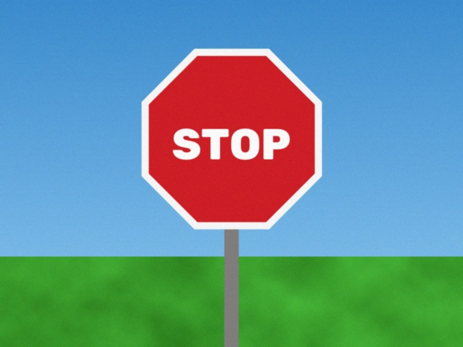
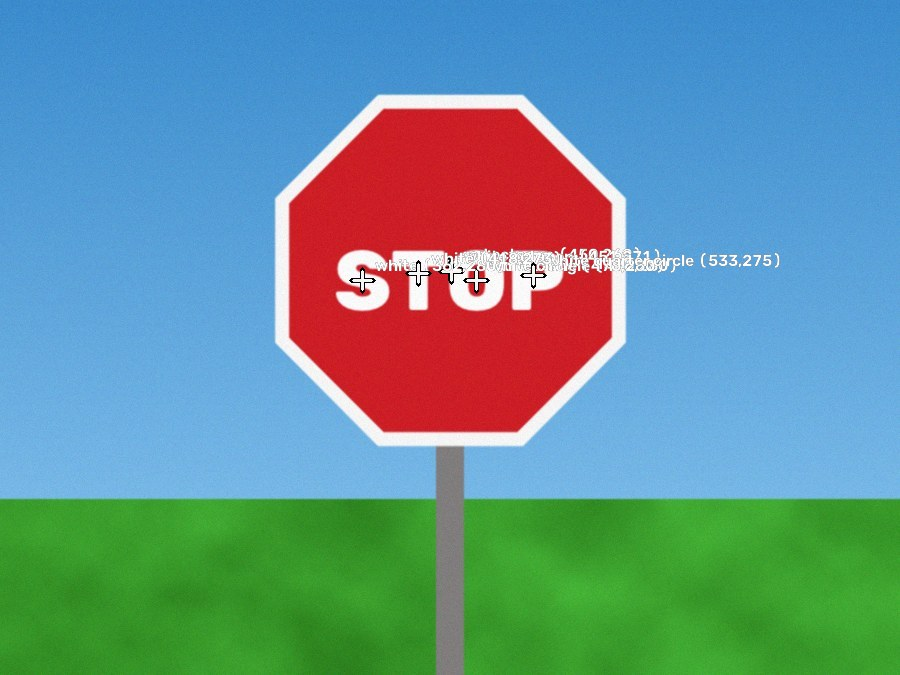
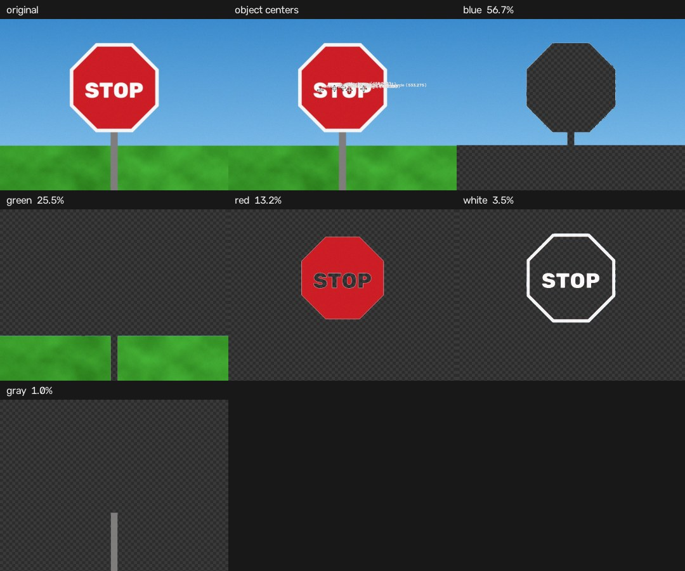
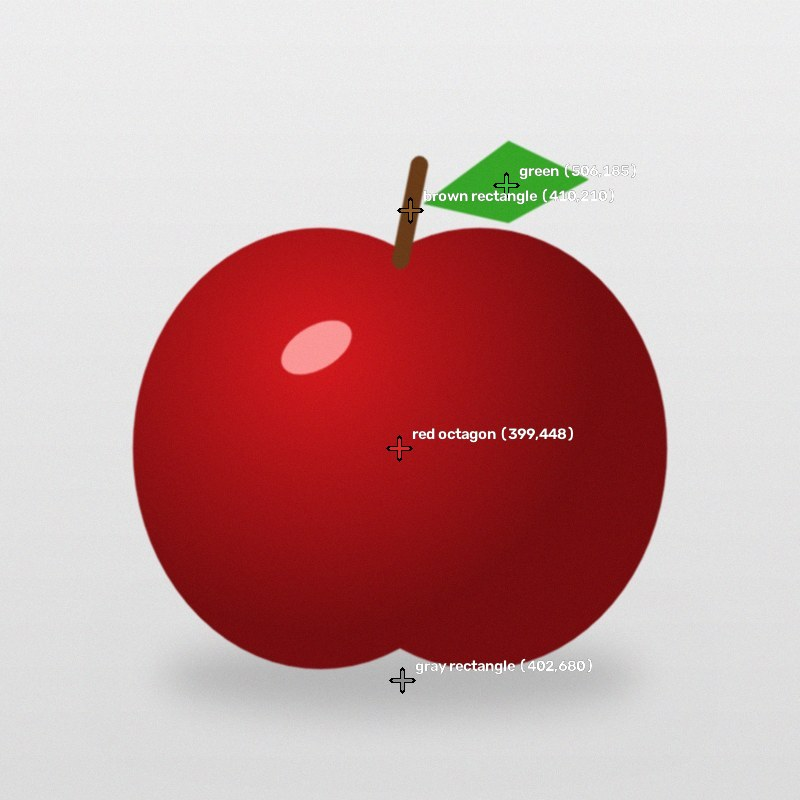
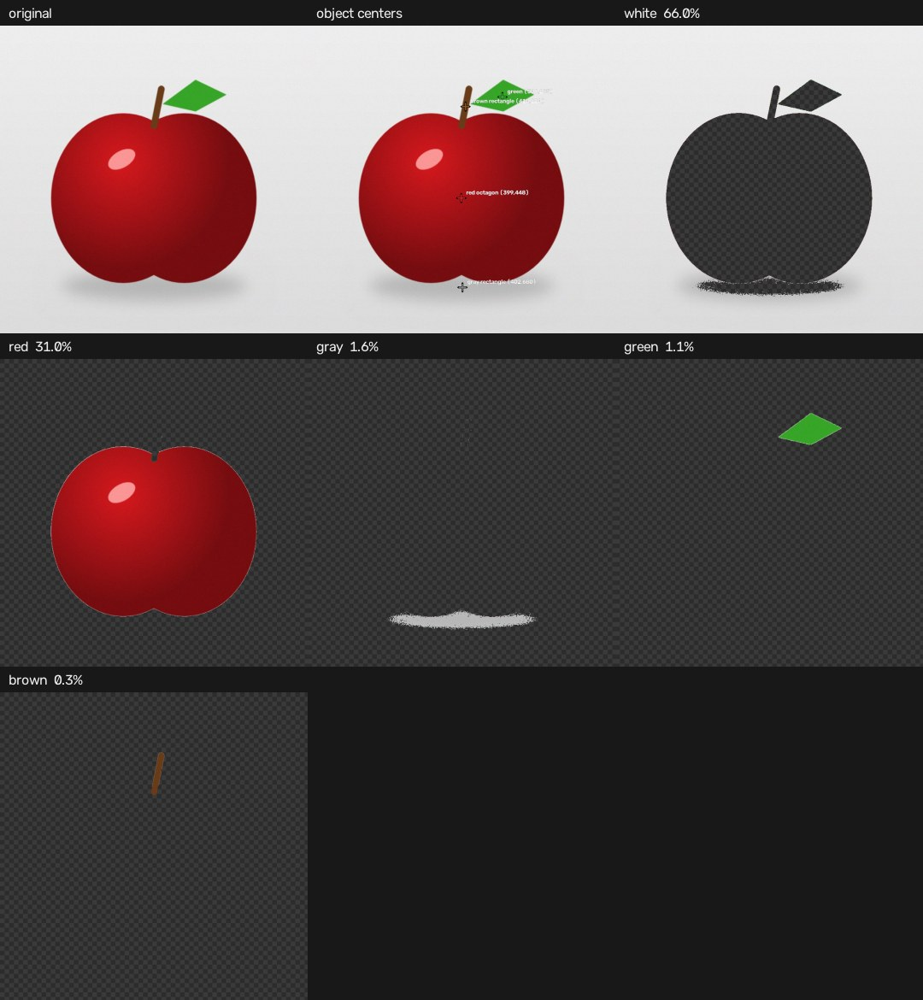
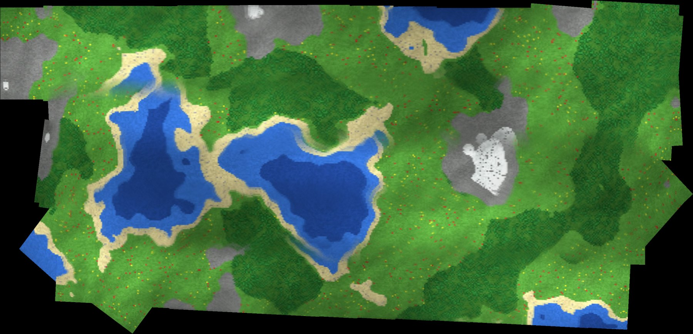
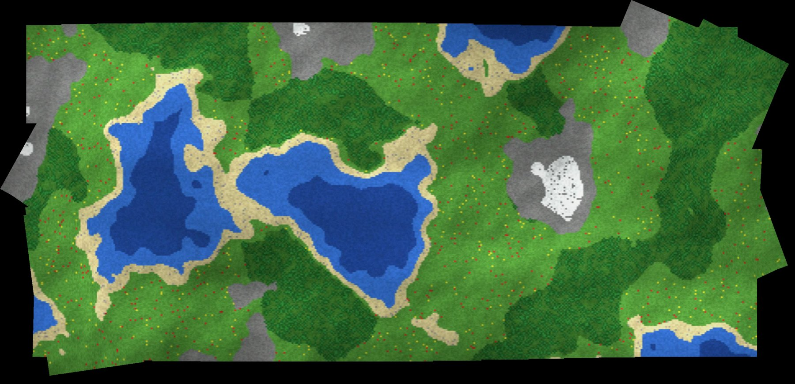
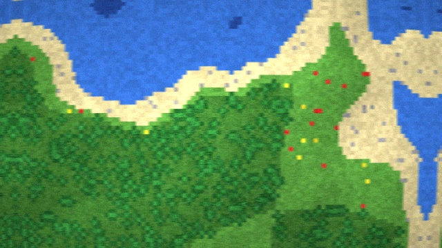

# Week 2: Computer vision and aerial imagery

Skill booster 1 from UAVs@Berkeley Software Ground School (15 September 2026). Lecture notes live in [`docs/week02/NOTES.md`](../docs/week02/NOTES.md).

* [Option 1: Color Me Impressed](#option-1-color-me-impressed)
* [Option 2: I'll be Needin' Stitches](#option-2-ill-be-needin-stitches)
* [Extra challenge: C++](#extra-challenge-c)
* [Testing against ground truth](#testing-against-ground-truth)

## Option 1: Color Me Impressed

> Take the file path of an image, split it into multiple images where each image only has one color, display them, and (bonus) print the center of each individually colored object in pixels.

```bash
python -m week02 colors path/to/image.jpg                   # windows per color + report
python -m week02 colors path/to/image.jpg --out layers --json report.json --no-show
python -m week02 colors path/to/image.jpg --mode auto       # learn the palette instead
```

```text
red      2.1% of pixels, overall center (x=202.0, y=227.6)
        object 1: center (x=197.0, y=225.6), area 21441 px, octagon (0.98 IoU)
orange   2.1% of pixels, overall center (x=905.2, y=646.2)
        object 1: center (x=904.8, y=648.1), area 21041 px, cross (0.98 IoU)
yellow   1.4% of pixels, overall center (x=954.3, y=307.3)
        object 1: center (x=1078.2, y=240.8), area 9383 px, star (0.96 IoU)
        object 2: center (x=635.6, y=195.8), area 1106 px
```

The last line is the yellow letter "A" printed on the blue triangle: letters come out as their own objects.

| Input | Centers | Every layer |
| --- | --- | --- |
|  |  |  |
|  |  |  |

### How it works

1. **HSV, as the hint suggests.** `cv2.cvtColor` to HSV puts "which color" in one channel (hue) and "how colorful" and "how bright" in the others.
2. **A partition, not a guess.** Twelve bands (red, brown, orange, yellow, green, cyan, blue, purple, pink, black, gray, white) are built with `cv2.inRange` so that every one of the 16.7 million possible pixels lands in exactly one band. Red wraps around the hue circle, so it gets two ranges. Brown is dark orange, so it is carved out by brightness. A test sweeps the HSV cube to check it.
3. **Masking.** Each layer is `cv2.bitwise_and(image, image, mask=mask)`; saved layers are transparent PNGs whose alpha channel is the mask.
4. **Centers.** A 3x3 opening removes JPEG speckle, `cv2.connectedComponentsWithStats` separates objects, and each center is `np.mean` over `np.where(mask)`, exactly the hint, verified against image moments.
5. **Shapes.** Hand tuned vertex counting fails on small, pixelated blobs, so [`shapes.py`](shapes.py) normalizes each blob (centroid to the origin, area to a reference) and searches rotations of 13 canonical SUAS shapes for the best intersection over union. Rectangles use the blob's own aspect ratio. It scores 100% across 13 shapes, radii from 20 to 250 px and arbitrary rotations; the IoU doubles as a confidence.
6. **Auto palette.** `--mode auto` runs k-means in CIELAB, where distance approximates perceived difference, picks k by silhouette score, merges clusters under Delta E 10 and names each cluster from its center color.

## Option 2: I'll be Needin' Stitches

> Take the flight video, separate it into frames, and stitch the frames back together into one large image that spans the entire flight path.

```bash
python -m week02 frames flight.mp4 frames/ --every 10       # just the frames
python -m week02 stitch flight.mp4 --out mosaic.jpg         # the whole pipeline
python -m week02 stitch flight.mp4 --method stitcher        # OpenCV's cv2.Stitcher, for comparison
```

Useful flags: `--every N` sampling stride, `--scale 0.5` for large footage, `--k1` lens distortion, `--detector sift`, `--blend feather`, `--no-loops`, `--no-adjust`, `--no-gains`, `--live`, `--path-overlay path.jpg`, `--transforms poses.csv`, `-v`.

### The pipeline

| Stage | What and why |
| --- | --- |
| Sample | `cv2.VideoCapture` + `cap.read()`, keeping frames where `index % every == 0`. |
| Undistort | Optional `cv2.initUndistortRectifyMap` remap. Straight lines must stay straight for a similarity model to fit. |
| Features | CLAHE for low contrast terrain, ORB or SIFT over detected, then grid bucketed so points cover the whole frame and RANSAC is well conditioned. |
| Match | Brute force k nearest neighbors, Lowe's ratio test in both directions, mutual best matches only. |
| Align | `cv2.estimateAffinePartial2D` with RANSAC and Levenberg Marquardt refinement: a 4 degree of freedom similarity, the right model for a nadir camera. Transforms with implausible scale changes are rejected. |
| Track | A frame becomes a keyframe once it moves 18% of the frame diagonal. If alignment fails, the last good frame is promoted and matching retried; failing that, the frame is relocalized against every keyframe. |
| Loop closure | Predict which non consecutive keyframes overlap (the next lawnmower pass sees the same ground), match them, and keep only matches consistent with odometry. |
| Bundle adjustment | Levenberg Marquardt over all keyframe similarities at once, residuals in frame pixels in both directions, Huber weights, first frame fixed. See below. |
| Gain compensation | One exposure gain per keyframe from the mean intensities of overlapping pairs (Brown and Lowe 2007). |
| Blend | Burt and Adelson multi band blending: Laplacian pyramids of each frame mixed with Gaussian pyramids of Voronoi style seam masks, so low frequencies blend wide and edges stay sharp. |

<p align="center">
  
  
  <br><em>Left: chaining pairwise transforms, 56.7 px pose RMSE. Right: the full pipeline, 0.37 px.</em>
</p>

### A bug worth knowing about: scale collapse

The textbook way to write mosaic bundle adjustment is linear: with a similarity `[[a, -b, tx], [b, a, ty]]`, the constraint `G_i(p) = G_j(q)` is linear in both frames' parameters, so one least squares solve does it. It looked great on the calm flight. On the rough flight it made things worse (2.0 px to 15.4 px), and the panorama came out smaller.

The residual `G_i(p) - G_j(q)` is measured in mosaic pixels, so shrinking every frame shrinks every residual: the optimizer happily trades a 13% loss of scale for a slightly smaller error. The constraints were fine (true poses fit them to about 1 px); the objective was wrong. The fix measures error where it happens, in frame pixels: `(alpha_i p + beta_i - beta_j) / alpha_j - q` with each similarity written as a complex map `z -> alpha z + beta`. That residual is nonlinear but holomorphic, so its Jacobian falls straight out of complex derivatives, and Levenberg Marquardt converges in a handful of iterations. Recovered frame scales now match the truth within 0.3%.

### Why not `cv2.Stitcher`?

The slides mention the built in stitcher. In SCANS mode on 67 frames of the calm flight it ran for 104 s and returned a fragmented mosaic with frames scattered across the canvas ([result](../docs/week02/calm_cv2_stitcher.jpg)). It is a general purpose tool that does not know the frames form one continuous flight; the custom pipeline exploits that structure and finishes in about 20 s with 0.30 px error.

## Extra challenge: C++

[`cpp/`](cpp) contains C++17 ports of both options using the OpenCV C++ API, building against OpenCV 4.6 (Ubuntu) through 5.0 (Homebrew). See [`cpp/README.md`](cpp/README.md). CI builds them and checks parity with the Python versions.

* The color report is byte for byte identical to Python's on the test images.
* Given the same decoded frames, the stitcher finds the same keypoints, matches and transforms.
* On the calm benchmark flight it reaches 0.33 px pose RMSE in 15.4 s, against 0.30 px in about 22 s for Python.
* OpenCV 5 moved `estimateAffinePartial2D`, `moments` and friends into a new `geometry` module; the sources include it only when it exists, so one codebase builds on both major versions.

## Testing against ground truth

The real flight video is only shared inside the club, so [`synth.py`](synth.py) generates everything from a seed:

* test photos (stop sign, apple, five SUAS targets with known shapes, colors, letters and centers);
* a top down voxel world with water, beaches, meadows, forests, stone and snow;
* a lawnmower survey flight rendered to MP4 with barrel distortion, motion blur, exposure drift, vignetting, altitude wobble and sensor noise, plus the exact pose of every frame.

[`evaluate.py`](evaluate.py) aligns estimated keyframe poses to the truth with the Umeyama similarity and reports pose RMSE on a 5x5 grid per frame, plus zero normalized cross correlation between the mosaic and the true world.

```bash
python -m week02 simulate out/sim --hard
python -m week02 stitch out/sim/flight.mp4 --k1 -0.06 --truth out/sim/flight_truth.csv --world out/sim/world.png
python -m week02 benchmark docs/week02
```



Benchmark results: [`docs/week02/benchmark.md`](../docs/week02/benchmark.md).
