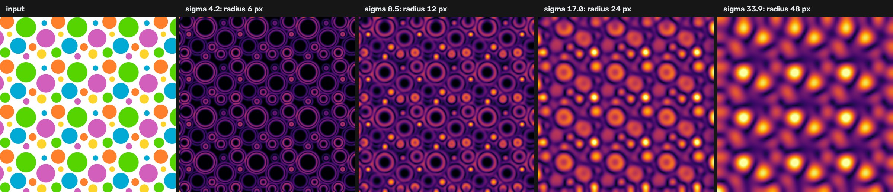
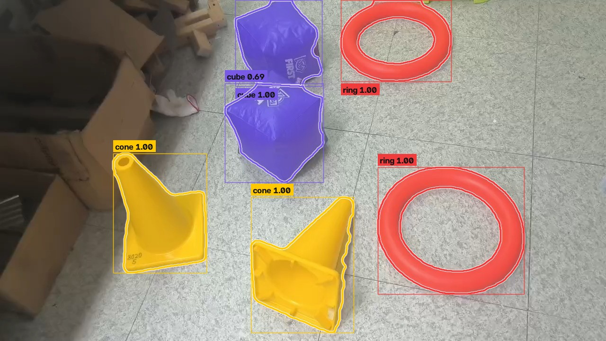
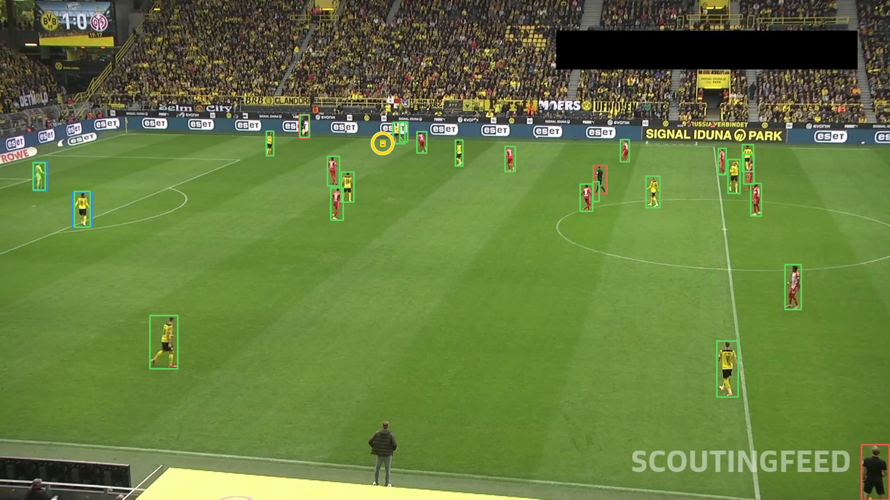

# Week 3: object detection

Skill booster 2 from UAVs@Berkeley Software Ground School (22 September 2026). Lecture notes live in [`docs/week03/NOTES.md`](../docs/week03/NOTES.md); the showcase page is [uav-ground-school.pages.dev/week3](https://uav-ground-school.pages.dev/week3).

* [Option 1: OpenCV blob detection](#option-1-opencv-blob-detection)
* [Challenge 1: LoG, DoG, DoH and contours](#challenge-1-log-dog-doh-and-contours)
* [Challenge 2: cones, cubes and rings](#challenge-2-cones-cubes-and-rings)
* [Bonus: the shapes file](#bonus-the-shapes-file)
* [Option 2: YOLOv8](#option-2-yolov8)
* [C++](#c)
* [Ground truth and tests](#ground-truth-and-tests)

```bash
pip install -e ".[dev]"            # Option 1, challenges, tests
pip install -e ".[dev,yolo]"       # plus Option 2 (Ultralytics, Hugging Face)
```

The five images from the week's Drive folder are in [`docs/week03/photos`](../docs/week03/photos).

## Option 1: OpenCV blob detection

> Use SimpleBlobDetector to detect the polka dots in the 3 images. Try to filter blobs by size or color.

```bash
python -m week03 dots docs/week03/photos/polka_dots_2.jpg --method contrast
python -m week03 dots docs/week03/photos/polka_dots_1.png --colors green,cyan --min-radius 20
python -m week03 compare docs/week03/photos/polka_dots_3.jpg --out sheet.jpg
```

```text
docs/week03/photos/polka_dots_2.jpg: 50 dots with contrast in 0.44 s (50 candidates)
  green        13
  cyan         12
  blue         10
  red          8
  pink         7
against polka_dots_2.json: precision 1.000, recall 0.943, F1 0.971 (50 found, 0 false, 3 missed)
```

When a photo has an annotation file, every run is scored against it. SimpleBlobDetector runs three ways, all through [`blobs.detect_simple`](blobs.py):

| Method | What SimpleBlobDetector sees | Photos F1 |
| --- | --- | ---: |
| `gray` | the grayscale image, the textbook one liner | 0.770 |
| `simple` | a smoothed similarity map per color of a palette learned with k-means in CIELAB | 0.915 |
| `contrast` | Delta E between each pixel and a median filtered background | 0.979 |

The grayscale detector finds **none of the 53 dots on the fabric**: cyan and green dots have almost the gray value of the orange cloth. SimpleBlobDetector only ever thresholds brightness, so the fix is to give it an image whose brightness is color difference.

Filtering by size is SimpleBlobDetector's own `filterByArea` (from `--min-radius` and `--max-radius`), and every candidate also goes through `filterByCircularity`, `filterByConvexity` and `filterByInertia` (see `BlobFilter`). Filtering by color happens after measurement: each dot's color is the median of its inside in CIELAB, named with the week 2 HSV bands plus pastel names (`light blue`, `beige`, `cream`), and `--colors red,green` keeps those names.

### What happens after a detector fires

Detectors only propose. [`dots.find_dots`](dots.py) then measures every candidate the same way, whichever detector proposed it:

1. **Colors.** Dot color from the core, background color from a ring at 1.3 to 1.55 radii.
2. **Edge fit.** Along 48 rays the edge is located where the color, projected on the line from background to dot color, crosses halfway. A Kasa circle fit with two rounds of MAD outlier rejection re-centers the rays twice, and a final `cv2.fitEllipse` gives the roundness (1 minus the RMS residual over the radius) and the aspect ratio. Dots seen at an angle are ellipses, so they keep scoring well; squares top out at 0.90 roundness and real dots bottom out at 0.947, hence the 0.93 threshold.
3. **Verify.** The inside must be one color (fill), the ring just outside a different color (leak), and that ring must itself be mostly one color (surround). The last test is what rejects the white gaps enclosed by four dots in `polka_dots_1.png`, which LoG happily reports as white blobs.

The ablation in [`dots_benchmark.md`](../docs/week03/dots_benchmark.md) shows what this buys: synthetic F1 for LoG goes from 0.905 to 0.998 and the median center error from 0.16 px to 0.02 px.

## Challenge 1: LoG, DoG, DoH and contours

> Detect objects using other methods (LoG, DoG, DoH, contour filtering).

```bash
python -m week03 dots docs/week03/photos/polka_dots_3.jpg --method doh -v
python -m week03 benchmark docs/week03
```

The scale space detectors in [`blobs.py`](blobs.py) are written from OpenCV primitives:

* **LoG** `-sigma^2 Laplacian(G_sigma * I)`, **DoG** `(G_sigma - G_k sigma) * I / (k - 1)` and **DoH** `sigma^4 det(Hessian)`, on the CIELAB image so responses are in Delta E. For a disk of contrast `c` all three peak at `2c/e` when `sigma = r / sqrt(2)`, so one threshold means the same for all three.
* **Pyramid.** Scales above 8 px are filtered on a downsampled image and the response upsampled; scale normalized responses do not change with resolution. This took the 1280 x 1280 fabric from 49 s to about 5 s.
* **Split channels.** Peaks are searched on the color magnitude and on each signed channel. A pale blue dot on white is almost pure `b`; in the combined magnitude it drowns next to a card edge that is almost pure `L`.
* **Streaming.** Maxima are found three scale slices at a time and refined with a 3D quadratic fit (as in SIFT), so memory does not grow with the number of scales.
* **Sidelobes.** A disk's Laplacian is ringed by a weaker response of the opposite sign, which shows up as a necklace of false peaks around every strong dot. A peak is dropped when a blob three times stronger is nearby *and* their per channel signatures point in opposite directions (cosine below -0.7). The first version checked strength and distance only, and deleted the pale pink dots next to the black ones.
* **Contours** (`contour`): Canny on CIELAB, then every region enclosed by color edges, filtered like SimpleBlobDetector.

A test checks the LoG against `skimage.feature.blob_log` on the same image: same blobs, centers within a pixel.

### Results

On the three photos (F1; hand checked truth, see below):

| Method | Flat print (136) | Fabric (53) | Cards (28) | All |
| --- | ---: | ---: | ---: | ---: |
| SimpleBlobDetector, grayscale | 0.903 | 0.000 | 0.923 | 0.770 |
| SimpleBlobDetector, per palette color | 0.989 | 0.809 | 0.667 | 0.915 |
| SimpleBlobDetector, background contrast | 0.981 | 0.971 | 0.982 | 0.979 |
| Contours on color edges | 0.989 | 0.918 | 0.923 | 0.964 |
| Laplacian of Gaussian | 1.000 | 0.981 | 1.000 | 0.995 |
| Difference of Gaussians | 1.000 | 0.991 | 1.000 | **0.998** |
| Determinant of Hessian | 1.000 | 0.971 | 0.982 | 0.991 |

Across all seven methods and three photos there is one false positive (DoH, on the fabric). On 21 synthetic scenes with exact truth (fabric, pastels, distractor shapes, perspective and defocus, tiny and crowded dots), LoG and DoH reach 0.998 F1 with a median center error of 0.02 px and radius error of 1%. Full tables: [`docs/week03/dots_benchmark.md`](../docs/week03/dots_benchmark.md).

<p align="center">
  
</p>

## Challenge 2: cones, cubes and rings

> Try to detect and classify the cones, cubes, and rings in the objects file (with accurate contours or bounding boxes).

```bash
python -m week03 objects docs/week03/photos/objects.jpg --out pieces.jpg
```

```text
docs/week03/photos/objects.jpg: {'cone': 2, 'cube': 2, 'ring': 2} in 0.78 s
against objects.json: 6/6 found, 6 classified correctly, 0 false positives, mean mask IoU 0.942, mean box IoU 0.955
```

<p align="center">
  
</p>

No training data, so [`objects.py`](objects.py) reasons about the scene:

1. **Seeds and hysteresis.** Plastic is saturated and bright; cardboard is dull and dark. Strict thresholds give seeds, then each color grows into weaker saturation of the same hue if connected (the shaded underside of the lower cube has saturation 90 to 121).
2. **Hue clusters** on the circle (k-means on cos/sin, elbow rule), so nothing assumes which color a class is.
3. **Touching cubes.** Two thick centers in the distance transform, and a notch on each side where the silhouettes meet: the cut runs along the shortest segment between two convexity defects that separates the two centers. A marker watershed on the color gradient was tried first and followed the white FIRST logo instead of the cube edge.
4. **Classify by geometry.** A ring has a large central hole. A cube is a convex polyhedron, so its silhouette is convex (solidity 0.94 to 0.97). A cone is concave where the body meets the base flange (solidity 0.86 to 0.88) and its convex hull is close to a triangle, standing or lying down.

Because nothing depends on color or orientation, the same image rotated by 35 and 90 degrees, mirrored, halved and hue shifted by 90 and 180 degrees still reads 2 cones, 2 cubes and 2 rings ([figure](../docs/week03/objects_robustness.jpg)). GrabCut refinement of the outlines is available (`--grabcut`) but scored lower (0.932 mask IoU) and is off by default.

**Ground truth** is from SAM 2.1, the lecture's annotation shortcut: hand drawn boxes as prompts, masks checked by eye, stored as polygons in [`annotations/objects.json`](annotations/objects.json).

## Bonus: the shapes file

The Drive folder also had `shapes.png`: painted shapes on a textured gray ground. [`targets.py`](targets.py) segments by Delta E from the local background, classifies with the week 2 SUAS template matcher extended with ellipses (at the region's own aspect ratio), 4 to 8 pointed stars and outlines, and groups nearby round regions of similar color.

```bash
python -m week03 targets docs/week03/photos/shapes.png --out targets.jpg
```

It reports a red rectangle, a cyan pentagon, a green ellipse, a red six point star, a green outline, a group of 10 dots, and the cursor and arrow as irregular (neither is a SUAS shape).

## Option 2: YOLOv8

> Train your own YOLOv8 model, explore the options Roboflow provides for preprocessing and augmenting data, and see if you can do anything to improve performance.

```bash
python -m week03 yolo fetch                      # the notebook's dataset, no Roboflow key
python -m week03 yolo stats                      # frames, boxes, clips and the leak
python -m week03 yolo train baseline tiles       # train and score experiments
python -m week03 yolo figures                    # docs/week03/yolo
python -m week03 yolo predict runs/tiles/weights/best.pt frame.jpg --sliced
```

The notebook downloads Roboflow's football players dataset with an API key. The same Roboflow Universe export (CC BY 4.0, 372 frames at 1920 x 1080, classes ball, goalkeeper, player, referee) is mirrored on Hugging Face, so `fetch` needs no account.

**The split leaks.** Frame names start with a clip id, and all 9 test clips also appear in training, often a second apart. [`football.clip_split`](football.py) holds out whole clips instead (test: 2 clips, 74 frames; validation: 2 clips, 39 frames).

**Compute.** The notebook trains YOLOv8s at 800 px on a Colab T4. On the 8 GB Apple M1 used here YOLOv8s at 800 px does not fit in memory (it swaps to a crawl), so every experiment uses YOLOv8n and recipes are compared at equal step budgets.

**Scoring.** Ultralytics only scores its own whole frame inference, so every model is scored by [`detmetrics.py`](detmetrics.py): COCO style AP at IoU 0.50 and 0.50:0.95, 101 point interpolation. A test checks it against Ultralytics' `ap_per_class`.

| Experiment | Test split | Inference | mAP50 | mAP50-95 | Ball | Goalkeeper | Player | Referee |
| --- | --- | --- | ---: | ---: | ---: | ---: | ---: | ---: |
| `notebook-split` | Roboflow (leaky) | whole frame, 640 px | 0.609 | 0.395 | 0.000 | 0.844 | 0.965 | 0.628 |
| `baseline` | held out clips | whole frame, 640 px | 0.588 | 0.382 | 0.000 | 0.861 | 0.962 | 0.530 |
| `offline-aug` | held out clips | whole frame, 640 px | 0.580 | 0.347 | 0.000 | 0.776 | 0.944 | 0.599 |
| `hires-inference` | held out clips | whole frame, 1280 px | 0.419 | 0.268 | 0.000 | 0.142 | 0.943 | 0.590 |
| `tiles` | held out clips | whole frame, 640 px | 0.380 | 0.215 | 0.100 | 0.216 | 0.896 | 0.308 |
| `tiles` | held out clips | sliced, 640 px | **0.820** | 0.567 | 0.569 | 0.945 | 0.965 | 0.799 |

* On their own test sets the same recipe scores 0.609 mAP50 on Roboflow's split and 0.588 on held out clips. Those are different frames, so the gap mixes the leak with how hard each test set is.
* A controlled check scores both models on the same 11 frames: Roboflow test frames from the two held out clips, whose neighboring frames the leaky model trained on and the clean model never saw. The leaky model scores 0.712 mAP50 and the clean one 0.660 (+0.052); on referees, the class that depends most on context, 0.868 against 0.675. 11 frames is a small sample, and the leaky model also had more training frames (298 against 259), but both comparisons point the same way. Every row below the first uses held out clips.
* The baseline finds players well but the ball not at all: ball AP50 0.000, because an 11 px ball is under 4 px after resizing to 640.
* Training at 1280 px does not fit an 8 GB M1 (over 25 minutes per epoch, swapping). Running the baseline weights at 1280 px instead gives mAP50 0.419 (ball 0.000, goalkeeper 0.142): every object is suddenly twice the size the model learned. Resolution has to change in training and inference together, which is what tiling does.
* Roboflow style offline augmentation (two extra copies, the same number of training steps) gives 0.580 mAP50. Ultralytics already augments online with mosaic, HSV jitter, flips and scaling, so the extra copies mostly repeat what it does.
* tiles: trained on 960x540 tiles, then run on overlapping tiles plus the whole frame and merged. mAP50 0.820 and ball AP50 0.569, against 0.380 and 0.100 for the same weights on whole frames.

<p align="center">
  
  
  <br><em>The same tiles model on a held out frame. Left: whole frame. Right: sliced, which finds the ball (ringed) and both goalkeepers.</em>
</p>

Experiment descriptions and training curves: [`docs/week03/yolo/results.md`](../docs/week03/yolo/results.md).

What was built to try to improve it:

* [`augment.py`](augment.py): Roboflow's augmentation catalogue (flip, 90 degree turns, crop, rotation, shear, hue, saturation, brightness, exposure, grayscale, blur, noise, cutout) with boxes that follow the pixels, and Roboflow's `Tile` preprocessing in [`football.tile_dataset`](football.py).
* [`slicing.py`](slicing.py): sliced inference in the spirit of SAHI. Overlapping 960 x 540 tiles at native resolution plus the whole frame, boxes touching an inner tile border dropped, then class aware NMS.

## C++

[`cpp/`](cpp) ports the dot detectors (`polka_dots`: LoG, DoG, DoH, contrast and grayscale SimpleBlobDetector, the edge fit and verification) and the game piece classifier (`game_pieces`) to C++17. Against Python on six synthetic scenes and the three photos, every method matches with F1 1.000 and centers within 0.01 px; see [`cpp/README.md`](cpp/README.md). CI builds both and runs the parity tests.

## Ground truth and tests

* **Polka dots**: [`annotations/polka_dots_*.json`](annotations). Candidates from several detectors at a low threshold were drawn numbered on 2x crops, every one was checked by eye, fabric specks were removed and missed dots added by hand. Dots less than half inside the frame are `difficult` (optional); on the third photo the defocused cards are `ignore` polygons. The geometry comes from the same edge fit the pipeline uses, so on the photos only precision and recall are scored.
* **Synthetic scenes**: [`synth.py`](synth.py) renders dots at 4x supersampling with exact centers and radii (and, under perspective, the radius of the equal area circle from the homography's Jacobian). A regression test checks the pixel center convention: an early version was off by 0.375 px in x and y, which showed up as the same 0.53 px error for seven different detectors.
* `pytest` covers every module: scale space theory (peak scale and height), polarity, color blobs invisible in gray, pyramids, sidelobes, the scikit-image comparison, filters, border dots, synthetic accuracy, evaluation semantics, object features and invariance, box following augmentations, tiling, the mAP implementation against Ultralytics, sliced inference, the CLI and the site build.
