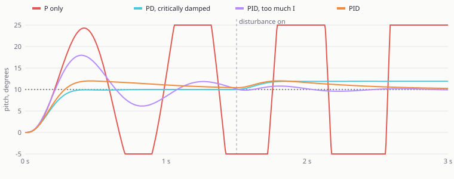

# Week 4: flight controllers and Protocol Pro

Skill booster 3 from UAVs@Berkeley Software Ground School (29 September 2026). Lecture notes live in [`docs/week04/NOTES.md`](../docs/week04/NOTES.md); the showcase page, with a clickable wiring diagram, a logic analyser and a PID playground, is [uav-ground-school.pages.dev/week4](https://uav-ground-school.pages.dev/week4).

> **Protocol Pro.** Design your own drone! Pick out a flight controller and some sensors off the internet. Draw a model of what the wiring setup looks like to connect everything together! Think about communication protocols and ensure compatibility. Documentation is key.

<p align="center">
  
</p>

* [The drone](#the-drone)
* [Wiring, pin by pin](#wiring-pin-by-pin)
* [Is it compatible? The design rule checker](#is-it-compatible-the-design-rule-checker)
* [The flight controller's parameters](#the-flight-controllers-parameters)
* [Every protocol, from its specification](#every-protocol-from-its-specification)
* [One RTK correction, five protocols](#one-rtk-correction-five-protocols)
* [Checked on the real firmware](#checked-on-the-real-firmware)
* [Would it fly on PX4 or Betaflight?](#would-it-fly-on-px4-or-betaflight)
* [PID: Isabelle, Preeti and Darren](#pid-isabelle-preeti-and-darren)
* [C++](#c)
* [Tests](#tests)

```bash
pip install -e ".[dev]"
python -m week04 check          # the compatibility report
python -m week04 harness        # pin by pin cables
python -m week04 params --out protocol_pro.param
python -m week04 journey        # one RTK correction through five protocols
python -m week04 firmware       # what would still work on PX4 or Betaflight
python -m week04 docs           # regenerate docs/week04
```

## The drone

A 500 mm RTK survey quad around the club's flight controller, the CubePilot **Cube Orange+** on the ADS-B carrier board.

| Job | Part | Talks to the Cube over |
| --- | --- | --- |
| Flight controller | Cube Orange+ (3 IMUs, 2 barometers, built in ADS-B IN) | |
| RTK GPS and compass | CubePilot Here4 | DroneCAN on CAN1 |
| Onboard computer | NVIDIA Jetson Orin Nano Super | DDS (ROS 2) on TELEM2, MAVLink on USB |
| Gimbal camera | SIYI A8 mini | SIYI serial on GPS1; video to the Jetson over Ethernet |
| RC receiver | RadioMaster RP3 V2 (ExpressLRS) | CRSF on GPS2 |
| Telemetry radio | RFDesign RFD900x-US | MAVLink 2 on TELEM1 |
| Rangefinder | Benewake TFmini-S | I2C |
| Airframe | Holybro X500 V2 (2216 KV920, 1045 props, 20 A BLHeli_S ESCs) | DShot300 on AUX1 to AUX4 |
| Power | 4S 5000 mAh LiPo, Holybro PM02 V3, two Mateksys BEC12S-PRO (12 V for the Jetson, 5.2 V for the radio) | analog voltage and current on POWER1 |

The parts are in [`data/catalog.json`](data/catalog.json), researched on 30 September 2026 against datasheets, vendor pages, and ArduPilot's source at the `Copter-4.7.1` tag. **Every figure has a source URL.** What vendors do not publish (the carrier board's mass, the motor's winding resistance, the Here4's current draw) is filled in as an explicit estimate with its reasoning, and the page and the parts table mark it "est.". The bill of materials is [`docs/week04/bom.md`](../docs/week04/bom.md): **$1,963.75** airborne, 1.99 kg all up.

**Flight time, calibrated rather than guessed.** [`performance.py`](performance.py) models each motor and propeller from first principles (propeller thrust and power coefficients, back EMF, resistance, no load current). The two numbers nobody publishes, the propeller's power coefficient and the lumped resistance of motor, ESC, wiring and battery, are fitted so the stock X500 V2 kit reproduces Holybro's own two claims: 18 minutes of hover on a 5000 mAh pack, and 1 kg of payload at 70 percent throttle. The fitted model then gives a plausible 12.7 N and 19.4 A per motor at full throttle, which is exactly the 20 A ESC's limit. With this design's payload:

| | |
| --- | --- |
| Mass | 1.99 kg |
| Thrust to weight | 2.61 |
| Hover throttle | 60 percent |
| Hover current, avionics included | 21.7 A |
| Hover time to 20 percent charge | 11.0 minutes |

## Wiring, pin by pin

[`design.py`](design.py) turns each link in [`data/design.json`](data/design.json) into a cable: it reads every connector's pinout from the catalog, maps vendor pin names to roles (`UART1_TXD (pin 8)` is TX, `RXD/SDA` is RX or SDA), crosses TX to RX and RTS to CTS, and wires 5 V only when the flight controller powers the device. The full list is [`docs/week04/harness.md`](../docs/week04/harness.md). Two things it catches that a hand drawn diagram usually misses:

* **The TFmini-S's pin order is the reverse of the Cube's I2C port** (GND, 5V, SDA, SCL against 5V, SCL, SDA, GND) on a 1.25 mm connector, so a straight JST-GH cable would short 5 V to ground.
* **The RFD900x gets its own 5.2 V regulator** and shares only ground with TELEM1: it pulls 1 A when transmitting at 1 W, and CubePilot says never to power radios from the carrier.

The diagram at the top is drawn by [`diagram.py`](diagram.py) from the same data: each data wire leaves the controller from the side facing its part and gets its own routing lane, so no two wires cross or overlap.

## Is it compatible? The design rule checker

[`check.py`](check.py) runs 30 rules over the design. The current report ([`docs/week04/check.md`](../docs/week04/check.md)) has **0 errors, 17 warnings and 61 passed checks**. Rules:

| Rule | What it checks |
| --- | --- |
| Physical layer, one device per UART | UART, CAN, I2C, PWM and Ethernet match on both ends; a UART is point to point |
| Device protocol, baud rate | The device speaks the protocol; both ends agree on baud (CRSF is fixed at 420000, SIYI at 115200) |
| Receive DMA | High rate input needs DMA: GPS1's receive pin has none on this board, so CRSF goes on GPS2 |
| Logic level | 3.3 V against 5 V, flagging unverified levels |
| Pins and connectors | Every required signal exists on both sides; different connector families mean a custom cable |
| I2C | Unique addresses per bus, clock within every device's limit |
| CAN | Bitrate agreement, termination, bus load from the DroneCAN messages a Here4 sends (3 percent at 1 Mbit/s) |
| Firmware features | DDS needs `AP_DDS`, which the stable Cube Orange+ build leaves out |
| MAVLink channels | Which `MAVn_*` parameters belong to which port |
| Bandwidth | Telemetry streams plus RTK corrections against the UART's capacity: 2,973 of 5,760 B/s at 57600 baud |
| Power | Supply voltage windows (a 4S pack sags to 13.2 V), the Cube's 5 V groups (TELEM1 1.5 A, others 1 A shared), regulator loads, radio power |
| Propulsion | Thrust to weight, hover throttle, ESC current, battery C rating, power module and XT60 ratings, flight time |
| DShot | The ESC supports the rate; outputs sharing a timer share a protocol |
| Radio | Free space range with a 10 dB fade margin; bands that overlap |

Every rule is also tested by **breaking the design on purpose** (CRSF moved to GPS1, two devices on one UART, an I2C address clash, the radio powered from the carrier, DShot600 on BLHeli_S, a 3.5 kg payload and more) and checking that the matching rule fires.

## The flight controller's parameters

"How does firmware influence the capabilities of the flight controller?" Mostly through parameters, so [`params.py`](params.py) derives them from the wiring: each port's `SERIALn_PROTOCOL` and baud, CAN and GPS type, rangefinder, gimbal, battery monitor scaling, DShot on AUX1 to AUX4, stream rates, hover throttle from the performance model, failsafes and a fence. The result is [`docs/week04/protocol_pro.param`](../docs/week04/protocol_pro.param), 75 parameters with the reason for each.

Every name and value is validated against **ArduCopter 4.7.1's own parameter metadata** (generated from the source with ArduPilot's `param_parse.py`; the subset used is in [`data/ardupilot_params.json`](data/ardupilot_params.json)): names must exist, enums must be allowed values, bitmasks must use defined bits, and numbers must be in range. This caught three real traps:

* 4.7 renamed the stream rates from `SRn_*` to `MAVn_*`, and `n` counts **MAVLink ports in serial order**: USB is MAV1, TELEM1 is MAV2 (and the built in ADS-B receiver on SERIAL5 is MAV3).
* `GPS_TYPE` is now `GPS1_TYPE`, and the rangefinder limits are in metres (`RNGFND1_MAX`, not `_CM`).
* The PID tuner's first result set `ATC_RAT_PIT_I` to 1.08; the firmware's range is 0 to 0.6. The tuner now works inside the firmware's ranges.

## Every protocol, from its specification

| Module | Protocol | Checked against |
| --- | --- | --- |
| [`crc.py`](crc.py) | CRC-16/MCRF4XX (MAVLink), CRC-16/CCITT-FALSE (DroneCAN), CRC-8/DVB-S2 (CRSF), CRC-15/CAN, DShot | catalogue check values |
| [`uart.py`](uart.py) | UART framing, parity, stop bits, inversion | round trips, framing and parity errors |
| [`rc.py`](rc.py) | SBUS (100000 8E2 inverted) and CRSF (frames, telemetry, a resynchronising parser) | layouts, CRCs, noisy streams |
| [`dshot.py`](dshot.py) | DShot frames and pulse timing, bidirectional eRPM telemetry with GCR coding | every 12 bit period round trips |
| [`i2c.py`](i2c.py) | START, address, ACK, repeated START, STOP on SDA and SCL | its own decoder |
| [`can.py`](can.py) | CAN 2.0A and 2.0B frames bit by bit: stuffing, CRC-15, incremental destuffing, arbitration on a wired AND bus, worst case bus load | 2,908 C++ parity cases, arbitration properties |
| [`dronecan.py`](dronecan.py) | A DSDL parser, 64 bit type signatures, bit packing with tail array optimisation, multi frame transfers | **pydronecan**: all 15 vendored types' signatures, payloads and CAN frames |
| [`mavlink.py`](mavlink.py) | MAVLink 1 and 2 from the XML definitions: CRC_EXTRA, field ordering, truncation, signing, a stream parser with loss statistics, tlog reading | **pymavlink**: every message in the `ardupilotmega` dialect byte for byte, v1 and signing |
| [`rtcm.py`](rtcm.py) | RTCM 3 framing, CRC-24Q, message 1005, MSM4 layout | **pyrtcm** |

No generated code: the MAVLink codec reads the dialect from XML (or the compact JSON of ArduPilot 4.7.1's dialect in [`data/`](data)), and the DroneCAN codec parses the DSDL files in [`dsdl/`](dsdl) (MIT licensed, copied from ArduPilot's DroneCAN submodule).

## One RTK correction, five protocols

[`journey.py`](journey.py) follows one second of RTK corrections from a Here4 base station on the ground to the drone's Here4, encoding every hop with this week's code and decoding it again:

| Hop | Protocol | Units | Bytes | Time on the wire |
| --- | --- | ---: | ---: | ---: |
| Base station to laptop | RTCM 3: 1005 and four MSM4 messages | 5 | 629 | |
| Ground station to radio | MAVLink 2 `GPS_RTCM_DATA`, fragmented | 4 | 685 | |
| Radio, then TELEM1 | SiK at 64 kbit/s, UART 57600 8N1 | 4 | 856 | 204.5 ms |
| Autopilot to Here4 | DroneCAN `RTCMStream` transfers | 5 | 738 | |
| CAN bus | 29 bit frames with stuffing | 94 | 1,599 | 12.8 ms |

All 629 bytes arrive intact and the base position decodes to the Memorial Glade. The radio is the bottleneck: RTK corrections take 776 B/s, 13 percent of the telemetry link.

## Checked on the real firmware

[`sitl.py`](sitl.py) builds nothing itself: it drives **ArduCopter 4.7.1 compiled from the release tag** in software in the loop (the same flight code as on the Cube, with simulated sensors), and talks to it only through this week's MAVLink code. The results are in [`docs/week04/sitl.json`](../docs/week04/sitl.json):

* **Parameters:** 72 of 75 accepted and echoed with the same value. The three refused are the ones simulation cannot have: `BRD_SER1_RTSCTS` and `BRD_SER2_RTSCTS` (no flow control on simulated ports) and `DDS_ENABLE` (DDS is not in the build, like the stable Cube firmware).
* **Link budget:** with the TELEM1 stream plan loaded, every message arrived at its planned rate; 2,140 B/s measured against 2,375 B/s predicted, the difference being MAVLink 2's truncation of trailing zeros.
* **Channel mapping:** `MAV2_EXTRA1 = 4` gave 4.0 Hz of ATTITUDE on TELEM1 and `MAV1_EXTRA1 = 1` gave 1.0 Hz on USB. The rates are also only read at boot.
* **Signing:** a key sent with `SETUP_SIGNING` over USB; afterwards all 36 packets from the autopilot were signed and verified with this repo's SHA-256 code, TELEM1 refused an unsigned request and answered a signed one. (USB always accepts unsigned packets: ArduPilot treats channel 0 as physically secure.)
* **Flight:** a SITL frame model generated from this airframe (mass, inertia, hover throttle, disc area) armed, took off to 10 m in GUIDED and held a 10 degree pitch step. The recording is [`docs/week04/sitl_flight.tlog`](../docs/week04/sitl_flight.tlog), 6,933 packets that this repo's parser and pymavlink read identically.

To rerun: build SITL once (`./waf configure --board sitl && ./waf copter` in an ArduPilot checkout at `Copter-4.7.1`), set `ARDUPILOT_DIR`, then `python -m week04 sitl` or `python -m week04 docs --sitl`.

## Would it fly on PX4 or Betaflight?

The lecture's fourth question is how firmware shapes what a flight controller can do. For one drone the answer is a list, so [`firmware.py`](firmware.py) reads what this design needs from the design itself (the board, every link, RTK, the built in ADS-B receiver, the power module, missions, the control loop) and rates each against ArduPilot 4.7.1, PX4 v1.16.2 and Betaflight 2026.6.2. Every cell in [`data/firmware.json`](data/firmware.json) names the parameter or driver involved and links the firmware's own documentation or source; the full table is [`docs/week04/firmware.md`](../docs/week04/firmware.md).

| | ArduPilot 4.7.1 | PX4 v1.16.2 | Betaflight 2026.6.2 |
| --- | ---: | ---: | ---: |
| Features supported as designed | 14 of 15 | 9 of 15 | 5 of 15 |
| Supported with changes | 1 | 6 | 4 |
| Lost | 0 | 0 | 6 |

* **ArduPilot** runs all of it. The one change is DDS, which the stable Cube Orange+ firmware leaves out, so this design already plans a custom build with `AP_DDS`.
* **PX4** would fly this drone, with six changes. DDS is in its default build, which is easier than on ArduPilot. But message signing exists only in its development branch. The CRSF receiver driver needs a custom build. There is no SIYI gimbal driver, the TFmini-S is supported on UART but not I2C, the docs do not name the Here4, and terrain following is not available in missions.
* **Betaflight** cannot fly it at all. There is no Cube Orange+ board config, and nothing drives the eight outputs behind the Cube's IO coprocessor. Even with a custom board config it has no companion computer control, no DDS, no RTK injection, no ADS-B and no SIYI gimbal. What it does do better is the inner loop: PID on every gyro sample at 4 to 8 kHz, against 400 Hz by default on ArduPilot and PX4.

This is the design choice the lecture's table points at: Betaflight optimises for a pilot's hands, ArduPilot and PX4 for a mission. A survey drone with RTK, a companion computer and a gimbal is firmly the second kind.

## PID: Isabelle, Preeti and Darren

[`pid.py`](pid.py) turns the slides' three characters into a pitch axis simulator: rigid body, motor lag, a 10 degree step, then a gust at 1.5 s.

<p align="center"></p>

* **Preeti alone (P)** overshoots, and with motor lag the oscillation grows: the linearised loop has a pole in the right half plane.
* **With Darren (PD)** at the critical D gain (found by bisection) the step lands without overshoot, but the gust leaves a 1.9 degree offset.
* **Isabelle, please stop:** too much I winds up and rings.
* **All three** remove the gust's offset. No single loop gains give both a clean step and zero offset, because the integrator winds up during the climb; ArduPilot avoids it with a cascade (angle P into a rate PID) and input shaping.

The simulator's cascade mode, with ArduCopter's default rate gains on **this airframe's inertia and torque**, rises in 0.33 s; ArduCopter 4.7.1 SITL flying the same airframe rises in 0.32 s with 1 percent overshoot. A Nelder Mead tuner and Ziegler Nichols are included too; the tuner is bounded by the firmware's parameter ranges. The page's playground runs a JavaScript port ([`site/js/pid.js`](../site/js/pid.js)) that the tests hold to bit for bit agreement with Python.

## C++

[`cpp/`](cpp) ports the codecs (CRCs, SBUS, CRSF, DShot, CAN with arbitration, MAVLink framing and signing with a self contained SHA-256) to dependency free C++17, as one `protocol_tool` executable. [`tests/test_week04_cpp_parity.py`](../tests/test_week04_cpp_parity.py) checks **2,908 cases** against Python, error paths included, and runs in CI.

```bash
cmake -S week04/cpp -B build/cpp4 && cmake --build build/cpp4 -j
WEEK04_CPP_BUILD=build/cpp4 pytest tests/test_week04_cpp_parity.py
```

## Tests

`pytest tests/test_week04_*.py`: 121 tests. Beyond the reference library comparisons above: every firmware table cell has a support level and an https source and the table covers every link in the design, bit stuffing never leaves six equal bits, arbitration always picks the lowest identifier inside the arbitration field, DroneCAN transfers reject a wrong toggle or signature, the MAVLink parser counts CRC errors, losses, duplicates and unknown flags, the SITL measurements stay within 10 percent of the prediction, the committed docs match what the code generates, and the site's JavaScript simulator matches Python exactly.

## Known limits

* The design has not been built. The checker is only as good as the catalog, and some catalog entries are estimates (marked in the data and on the page).
* The flight time depends on a model fitted to two vendor claims; treat it as within about 15 percent.
* DDS was not exercised live: the stable firmware and the default SITL build leave it out, and running it needs a ROS 2 agent.
* The SIYI UART's logic level and the RP3's are inferred (3.3 V), not published.
