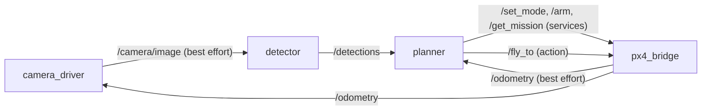

# Week 5: ROS 2, nodes and communication

Skill booster 4 from UAVs@Berkeley Software Ground School (6 October 2026). Lecture notes on nodes, topics, services, actions, QoS and callbacks are in [`docs/week05/NOTES.md`](../docs/week05/NOTES.md); every measurement below is in [`docs/week05/RESULTS.md`](../docs/week05/RESULTS.md); the showcase page is [uav-ground-school.pages.dev/week5](https://uav-ground-school.pages.dev/week5).

> Implement the publisher and subscriber example from the official ROS 2 Jazzy tutorial. Implement the service and client example from the official ROS 2 Jazzy tutorial.

Both are done, in Python and C++, in a colcon workspace with launch tests. Then the week goes three layers further down:

1. **The slides' drone, for real**: four nodes that talk through every pattern the lecture covers. A planner arms the drone, flies a survey with a `/fly_to` action, spots a target in the camera and lands on it, 0.14 m from where it really is.
2. **The slides' claims, measured**: incompatible QoS, late joiners, queue depth, callbacks that block a timer, and the `call()` deadlock, reproduced on ROS 2 Jazzy.
3. **ROS 2 without ROS 2**: a pure Python RTPS participant, CDR codec and type hasher written from the specifications, with no ROS dependency. It talks to the tutorial's real nodes in both directions.

* [Running it](#running-it)
* [The tutorials](#the-tutorials)
* [The drone](#the-drone)
* [QoS and callbacks, measured](#qos-and-callbacks-measured)
* [ROS 2 without ROS 2](#ros-2-without-ros-2)
* [Tests](#tests)

## Running it

ROS 2 does not run natively on macOS or Windows, and the club's Docker image was not ready on 6 October, so the repo ships its own: [`ros2_ws/Dockerfile`](../ros2_ws/Dockerfile) (ROS 2 Jazzy plus `example_interfaces`, `vision_msgs` and Cyclone DDS).

```bash
python -m week05 docker build                       # once
python -m week05 docker test                        # colcon build, colcon test
python -m week05 docker run ros2 run py_pubsub talker
python -m week05 docker run ros2 launch ugs_drone drone.launch.py
python -m week05 docker shell                       # anything else
```

On Ubuntu with ROS 2 Jazzy installed, `cd ros2_ws && colcon build && source install/setup.bash` works directly.

## The tutorials

[`ros2_ws/src`](../ros2_ws/src) holds the tutorial packages exactly as the Jazzy tutorials build them, created with `ros2 pkg create`:

| Package | Tutorial | Run |
| --- | --- | --- |
| `py_pubsub` | Writing a simple publisher and subscriber (Python) | `ros2 run py_pubsub talker`, `ros2 run py_pubsub listener` |
| `py_srvcli` | Writing a simple service and client (Python) | `ros2 run py_srvcli service`, `ros2 run py_srvcli client 2 3` |
| `cpp_pubsub` | Writing a simple publisher and subscriber (C++) | `ros2 run cpp_pubsub talker`, `ros2 run cpp_pubsub listener` |
| `cpp_srvcli` | Writing a simple service and client (C++) | `ros2 run cpp_srvcli server`, `ros2 run cpp_srvcli client 2 3` |
| `tutorial_interfaces` | Creating custom msg and srv files | `ros2 interface show tutorial_interfaces/msg/Sphere` |

```console
$ ros2 run py_srvcli client 2 3
[INFO] [minimal_client_async]: Result of add_two_ints: for 2 + 3 = 5
```

The node code is the tutorials' own (the Python publisher and subscriber are the `ros2/examples` files the tutorial downloads). Beyond the tutorial, every package has all of ament's linters switched on (copyright, flake8, pep257, cpplint, uncrustify, xmllint and lint_cmake; cppcheck skips itself on cppcheck 2.x), and a launch test that starts the nodes and checks their output: the listener hears consecutive `Hello World: N`, and the client prints the sum and exits 0. Each launch test runs on its own `ROS_DOMAIN_ID`, so colcon can run them in parallel without the talkers hearing each other. The real transcripts are in [`docs/week05/transcripts.json`](../docs/week05/transcripts.json).

## The drone

The slides end with one drone wired up by ROS 2. [`ugs_drone`](../ros2_ws/src/ugs_drone) and [`ugs_interfaces`](../ros2_ws/src/ugs_interfaces) build it:



* **px4_bridge** wraps a simulated multicopter (speed and acceleration limits, a battery). It publishes `/odometry` at 50 Hz, best effort like PX4's `/fmu/out` topics, and `/battery`. It publishes `/mission` once with transient local durability, serves `/arm` (`std_srvs/SetBool`, refused in the air), `/set_mode`, `/reset_odometry` and `/get_mission`, and executes `/fly_to` (the slides' `FlyToWaypoint.action`, verbatim). The action runs in a reentrant callback group on a multi threaded executor, so physics keeps ticking while a goal executes.
* **camera_driver** renders a nadir camera from the drone's pose: grass, plus an orange target on the ground.
* **detector** thresholds the frame and publishes a `vision_msgs/Detection2DArray`.
* **planner** asks for GUIDED, arms, takes off, and flies the mission legs with action goals, logging the feedback. Three confirmed sightings cancel the current leg and send a goal over the target; then it lands and disarms. Every call is `call_async` or `send_goal_async` with a done callback, so no callback ever blocks. A detection is projected to the ground using the odometry sample nearest the image's timestamp: with the drone's current position instead, the target came out 1.9 m off at 4 m/s.

```bash
ros2 launch ugs_drone drone.launch.py                      # finds the target, lands on it
ros2 launch ugs_drone drone.launch.py cancel_after_s:=2.0  # "an obstacle appears": the goal is canceled
```

Recorded run: target confirmed at (11.13, 7.06) m against the true (11, 7); landed at (11.13, 7.04) after 11.8 s. Both scenarios are launch tests. The slides' code snippets are runnable too: `altitude_pub`, `altitude_sub`, `battery_monitor`, `arm_server` and `arm_client`.

## QoS and callbacks, measured

`ros2 run ugs_drone lab` reproduces what the slides claim, on ROS 2 Jazzy:

| Claim | Measured |
| --- | --- |
| A reliable subscription will not connect to a best effort publisher | 0 of 20 received; both sides get an incompatible QoS event naming `reliability`. The other three pairings receive 20 of 20. |
| Transient local: late joiners also get the last N | A message published once: a late transient local subscription gets it, a late volatile one does not, and a transient local subscription to a volatile publisher is refused. |
| The depth N of keep last N bounds what a slow subscriber can catch up on | 300 messages at 1 kHz into a 10 ms callback: 28 received with depth 1, 35 with 10, 126 with 100, all 300 with keep all. |
| While one callback runs, the others wait | A 50 ms timer next to a 300 ms callback: worst gap 318 ms on a single threaded executor, still 342 ms on a multi threaded executor with one callback group, 87 ms with separate groups. |
| `call()` inside a callback deadlocks | It hangs (killed after 6 s). `call_async` with a done callback returns in 2 ms; `call()` in a reentrant group on a multi threaded executor in 8 ms. |

## ROS 2 without ROS 2

ROS 2 has no wire protocol of its own: rmw hands every message to a DDS implementation, and DDS implementations talk to each other with the OMG's RTPS protocol over UDP. This package implements that stack from the specifications, in the standard library only:

| Module | What it is | Checked against |
| --- | --- | --- |
| [`rtps.py`](rtps.py) | DDSI-RTPS 2.5: header, DATA, DATA_FRAG, HEARTBEAT, ACKNACK, GAP, INFO_*, parameter lists, SPDP and SEDP data, QoS policies, the port mapping, ROS 2's `rt/`, `rq/`, `rr/` and `pkg::msg::dds_::Name_` naming | captures of the real tutorial nodes |
| [`participant.py`](participant.py) | A participant: SPDP announcements, reliable SEDP, reliable and best effort readers and writers (history, HEARTBEAT, ACKNACK, retransmission, GAP, in order delivery, fragmentation), durability, QoS matching, and ROS 2 services through `RELATED_SAMPLE_IDENTITY` | the tutorial nodes, Fast DDS and Cyclone DDS |
| [`cdr.py`](cdr.py) | CDR (XCDR1): alignment, strings, wide strings, arrays, bounded and unbounded sequences, nested types | `rclpy.serialization` |
| [`idl.py`](idl.py) | `.msg`, `.srv` and `.action` parsing, the messages rosidl derives (`_Request`, `_Event`, `_SendGoal`, `_FeedbackMessage` ...), and REP 2011 type hashes | the `.json` files rosidl generates |
| [`qos.py`](qos.py) | `rmw_dds_common::qos_profile_check_compatible`, word for word | `rclpy.qos.qos_check_compatible` |
| [`dissect.py`](dissect.py), [`pcap.py`](pcap.py) | A Wireshark style dissector that labels every byte | |

```bash
python -m week05 graph                   # like ros2 topic list -t, without ROS
python -m week05 echo /topic std_msgs/msg/String
python -m week05 pub /topic std_msgs/msg/String '{"data": "hi"}'
python -m week05 call /add_two_ints example_interfaces/srv/AddTwoInts '{"a": 2, "b": 3}'
python -m week05 serve-add-two-ints      # answers the tutorial's client
python -m week05 decode docs/week05/captures/pubsub.pcap -v
python -m week05 cdr std_msgs/msg/String '{"data": "Hello World: 0"}'
python -m week05 hash std_msgs/msg/String
python -m week05 qos sensor_data default
```

Results, all measured in the container ([`checks.json`](../docs/week05/checks.json), [`interop.json`](../docs/week05/interop.json)):

* **Interoperates.** The tutorial's talker reaches the Python listener and the Python talker reaches the tutorial's listener. The Python client gets `{'sum': 5}` from the tutorial's service, and the tutorial's Python and C++ clients get `42` from the Python service. A Cyclone DDS talker (`RMW_IMPLEMENTATION=rmw_cyclonedds_cpp`) reaches the Python listener too. The drone mission above was recorded by this participant: 79 topics and services discovered, and 179 camera frames (42 MB, each reassembled from DATA_FRAG fragments) decoded alongside odometry, detections and the action's feedback and status.
* **Type hashes.** 1,210 of 1,210 interfaces installed with ROS 2 Jazzy hash identically.
* **QoS.** 1,265,625 of 1,265,625 publisher and subscription pairs give the same verdict and the same reason string as rclpy.
* **CDR.** 300 of 300 random `AllTypes` messages (every field kind a `.msg` can have) are identical to rclpy's except in alignment padding, and rclpy reads all 300 back.

Three things the bytes taught, none of them in the tutorials:

* **Fast CDR never writes alignment padding.** rclpy's serialized messages carry leftover memory in the padding (300 of 300 here). And `serialize_message` reports rmw_fastrtps's size *estimate* as the length, 11 bytes past the real CDR on average.
* **Wanting a service is not enough to call it.** rmw_fastrtps drops a reply if the server has not yet matched the client's reply reader. So the client waits until the server's participant has acknowledged its reader's SEDP announcement, not just until it has matched the server's endpoints.
* **A reader must not guess.** Fast DDS sends a GAP and a HEARTBEAT before the DATA they describe. An early version that skipped to the heartbeat's last sequence number dropped its own service replies. The fix is the specification's rule: skip only what GAP and HEARTBEAT.first say is gone, and have the writer tailor both to each reader.

Without shared memory, Fast DDS uses UDP for a peer like this one, so no ROS configuration is needed. The captures were taken with `FASTDDS_BUILTIN_TRANSPORTS=UDPv4` so the ROS nodes' own traffic is visible to tcpdump.

## Tests

* `pytest tests/test_week05_*.py`: the parser, CDR, QoS, RTPS round trips, the committed captures, the dissector, the CLI, and two participants exchanging reliable, best effort, transient local, fragmented and service traffic over real sockets, including at 30 percent packet loss. The CDR, type hash and QoS tests use fixtures recorded from rclpy, so they run without ROS.
* `tests/test_week05_ros.py` runs in CI's ROS 2 container: interop in every direction, every installed type hash, CDR and QoS against rclpy live.
* `colcon test` in `ros2_ws`: all of ament's linters, the drone's unit tests, and launch tests for the four tutorials and both mission scenarios.
* `python -m week05 docs --ros` reruns every live experiment in Docker and regenerates `docs/week05`; a test checks that the committed docs match their generator.

## Known limits

* The participant implements what ROS 2's defaults use. It has no DDS security, no writer liveliness protocol, no content filters and no keyed topics, and its services follow rmw_fastrtps's request and reply correlation (Cyclone's services put the request id in the payload instead).
* The drone is simulated: point mass dynamics and a rendered camera, not Gazebo or PX4 SITL.
* Lab timings come from an 8 GB M1 running Docker, so treat the milliseconds as illustrative; the qualitative results are not timing sensitive.
